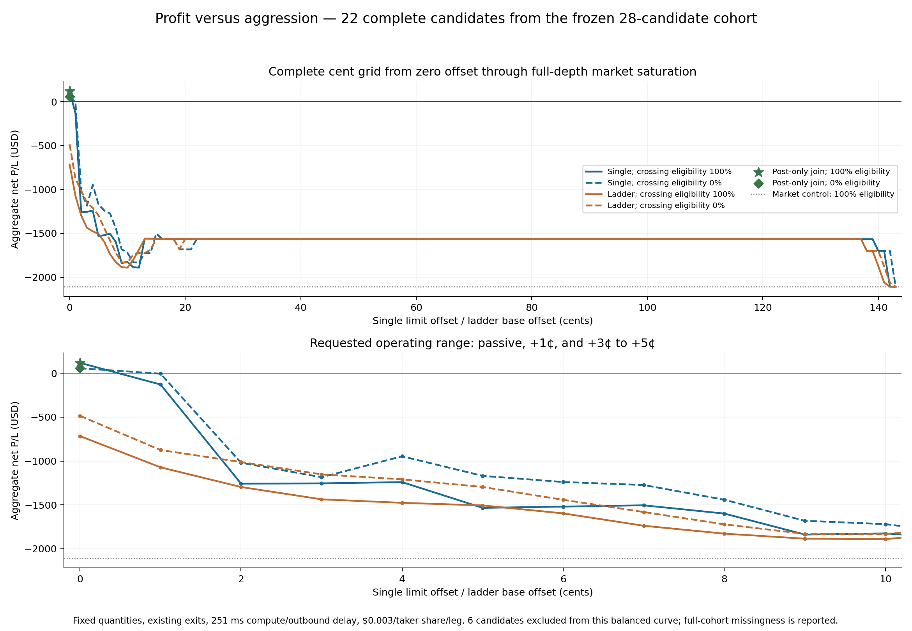
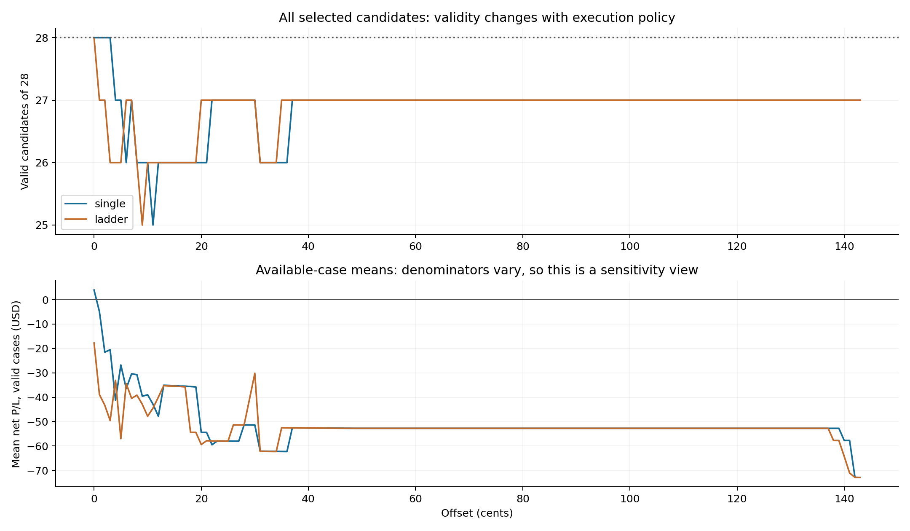
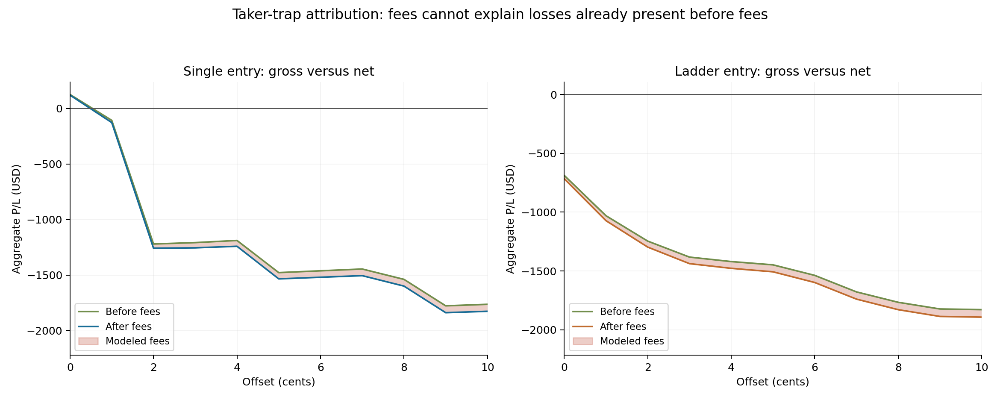
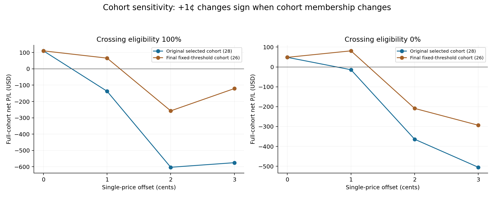

# Aggression Gradient — frozen Signal DNA cohort

**Observed scenario-robust choice on the 22-candidate balanced panel: post_only:0; minimum scenario net $57.80.** With WAIT=0 available, the choice is **post_only:0**. This is an empirical result on previously examined data, not a proven profitable machine.

**For all 28 primary candidates, the passive join earns $109.984 under full crossing eligibility and $48.342 under zero crossing eligibility.** All 28 branches are valid at this policy. There are only three fills in the first scenario and two in the second. The passive mean’s date-cluster 95% intervals include zero in both scenarios. The 0¢ result is a boundary maximum, not a newly discovered interior aggression sweet spot.

The primary target is the 28 candidates selected by the flow/depth rule’s held-out predictions, which generated the earlier −$43.28 mean. It contains eight of the original interior peaks, 14 complete nonpeaks and six unknown curve labels. The final fixed-threshold rule selects 26 candidates; that cohort is reported separately. Their union contains 29 candidates. The rule uses activity and opposing flow relative to full-depth liquidity; it is not a high-T or high-velocity requirement. No signal rule was retuned.

Every 1¢ single-price offset and three-child ladder base from 0¢ through 143¢ was evaluated under both existing fill assumptions. Post-only join and market controls are separate policies. The source data certified that wider bounds beyond the upper endpoint consume the same arrival-depth prefix as market entry. A high limit does not automatically pay that limit price.

**Peak locations on the common valid panel**

| Entry family | Crossing eligibility | Maximizing offsets (¢) | Total net | Mean net | Filled candidates |
|---|---:|---|---:|---:|---:|
| single | 0% | 0 | $57.80 | $2.63 | 1 |
| single | 100% | 0 | $119.44 | $5.43 | 2 |
| ladder | 0% | 0 | $-484.68 | $-22.03 | 15 |
| ladder | 100% | 0 | $-715.88 | $-32.54 | 16 |

A maximum at the passive boundary or a zero/no-fill plateau is not an interior profitability peak. All tied maximizing offsets are retained. No sum of per-signal hindsight-optimal offsets is presented as a strategy return.

**Requested execution scales, with full-cohort missingness visible**

| Policy | Valid / 28 | Filled | Known net sum | Mean valid-case net | Entry taker share |
|---|---:|---:|---:|---:|---:|
| post_only:0 | 28/28 | 3 | $109.98 | $3.93 | 0.0% |
| single:0 | 28/28 | 3 | $109.98 | $3.93 | 0.0% |
| single:1 | 28/28 | 8 | $-137.30 | $-4.90 | 75.8% |
| single:3 | 28/28 | 19 | $-574.91 | $-20.53 | 76.3% |
| single:4 | 27/28 | 19 | $-1,112.88 | $-41.22 | 83.4% |
| single:5 | 27/28 | 21 | $-723.16 | $-26.78 | 87.6% |
| ladder:2 | 27/28 | 19 | $-1,168.54 | $-43.28 | 84.4% |
| market | 27/28 | 27 | $-1,967.69 | $-72.88 | 100.0% |

Known sums omit invalid branches; they are not full-cohort totals when valid n<28. Invalid results remain unknown, while valid no-fills are zero. The balanced curve uses the same candidates at every policy and both scenarios; its exclusions are outcome-availability dependent and restrict interpretation. The original ladder:2 baseline reconciles exactly to 27 valid branches, −$1,168.538 total and −$43.279185 mean.

**The passive profit is concentrated.** Full-crossing fills are GE on 2020-01-30 (+$61.642), AMZN on 2025-12-09 (+$57.802), and UNH on 2025-12-08 (−$9.460). Entry liquidity is entirely maker at the passive join; exits can pay taker fees. Its 100 ms signed execution markout still averages −$0.01042/share, and its 1 s markout averages −$0.00470/share. Positive eventual exits do not yet demonstrate a solved adverse-selection problem.

**Taker trap and fees**

| Family | Eligibility | Positive → nonpositive offsets | Gross change | Fee change | Cause at destination |
|---|---:|---|---:|---:|---|
| single | 0% | 0¢ → 1¢ | $-44.82 | $17.44 | Fees turn positive gross negative |
| single | 100% | 0¢ → 1¢ | $-232.71 | $14.37 | Already nonpositive before fees |

All fees remain $0.003 per taker share per leg, with zero maker fee. Each positive-gross policy’s exact fixed-ledger fee root is gross USD divided by total taker shares across both legs; roots are supplied in JSON. A root assumes unchanged fills and exits and is not a universal fee threshold. Changes between offsets can also change participation, inventory, exits and realized gross value. The gross-minus-fees decomposition does not attribute all gross changes to entry slippage.

On the **full 28-candidate cohort**, the first reversal is 0¢→1¢. Under full crossing eligibility, +1¢ produces −$117.340 before fees, $19.956 of fees, and −$137.296 net: the loss already exists before fees. Under zero crossing eligibility, +1¢ produces +$3.910 gross, $18.027 fees and −$14.117 net: fees are decisive for the sign in that stress scenario. Its exact fixed-ledger fee root is $3.91 / 6,009 taker shares = approximately $0.00065069 per taker share per leg. These are different mechanisms under different fill assumptions, not a universal fee threshold.

**Conditional offset selection across dates**

| Split | Scenario | Test candidates | Abstained candidates | Valid P/L cases | Net sum | Mean |
|---|---:|---:|---:|---:|---:|---:|
| leave_one_date_out | 0% | 28 | 6 | 28 | $-9.46 | $-0.34 |
| leave_one_date_out | 100% | 28 | 6 | 28 | $52.18 | $1.86 |
| forward_dates | 0% | 19 | 5 | 19 | $-423.76 | $-22.30 |
| forward_dates | 100% | 19 | 5 | 19 | $-423.06 | $-22.27 |

Each training fold chooses the policy with highest minimum net value across both scenarios, requires complete training P/L for every candidate, and includes WAIT=0. Ties prefer WAIT, then lower aggression and a single quote before a ladder. Held-out dates never select their own offset. The forward version trains on at least three earlier dates. These are conditional offset-stability checks: cohort membership and the chosen feature family came from earlier analysis on these same dates, so they are not independent end-to-end validation.

**Fixed-threshold cohort sensitivity**

The final fixed rule selects 26 candidates, with 20 complete across all policies/scenarios. Its empirical robust trading choice is single:1, minimum scenario net $75.19; including WAIT gives single:1. Full curves are in `profit_vs_aggression_data.json`.

For the full 26-candidate cohort, the +1¢ single-price policy has eight fills and net +$65.532 under full eligibility and +$80.955 under zero eligibility. It maximizes the minimum result across these two scenarios among policies with complete cohort P/L. Passive entry remains the full-eligibility maximum; +1¢ is the two-scenario compromise. Its confidence intervals also include zero. This sensitivity does not validate a fixed +1¢ rule for the original 28 candidates, where the same offset loses money.

**Execution contract and limits**

Scale 0 is the separately tested post-only join. The earlier −$43.28 result used ladder:2, not pure passive execution. Single-price and ladder orders can take liquidity at arrival; market fills occur after the same 251 ms compute/outbound delay, not immediately at signal detection. Total requested quantity is unchanged when divided into three ladder children. Entry expiry, cancellation latency, stops, targets, holding limits and actual-fill risk guards remain unchanged.

The signed-flow unknown policy is unchanged: Type P prints remain unsigned. Selection uses only the frozen pretrade full-depth/tape features. Arrival-depth information is used only for offline equivalence proofs and replay, never to create or retime a signal. Hypothetical crossing-eligibility endpoints are model stress assumptions, not calibrated probabilities or universal outcome bounds.

Results are independent fixed-candidate order/inventory/exit branches using displayed XNAS depth. Concurrent account capital, cross-position sizing, hidden liquidity, routing and borrow costs are not modeled. No production strategy was edited and no account was activated. A deployable policy requires prospective testing under a compatible feed and execution route.

Execution provenance: 775 new complete replay runs; 16820 candidate-policy-scenario evaluations, including checksum-verified reused controls and depth-certified aliases. Candidate selection, source manifests, direct fill ledgers, missingness, saturation proofs and exact fee roots are retained.
