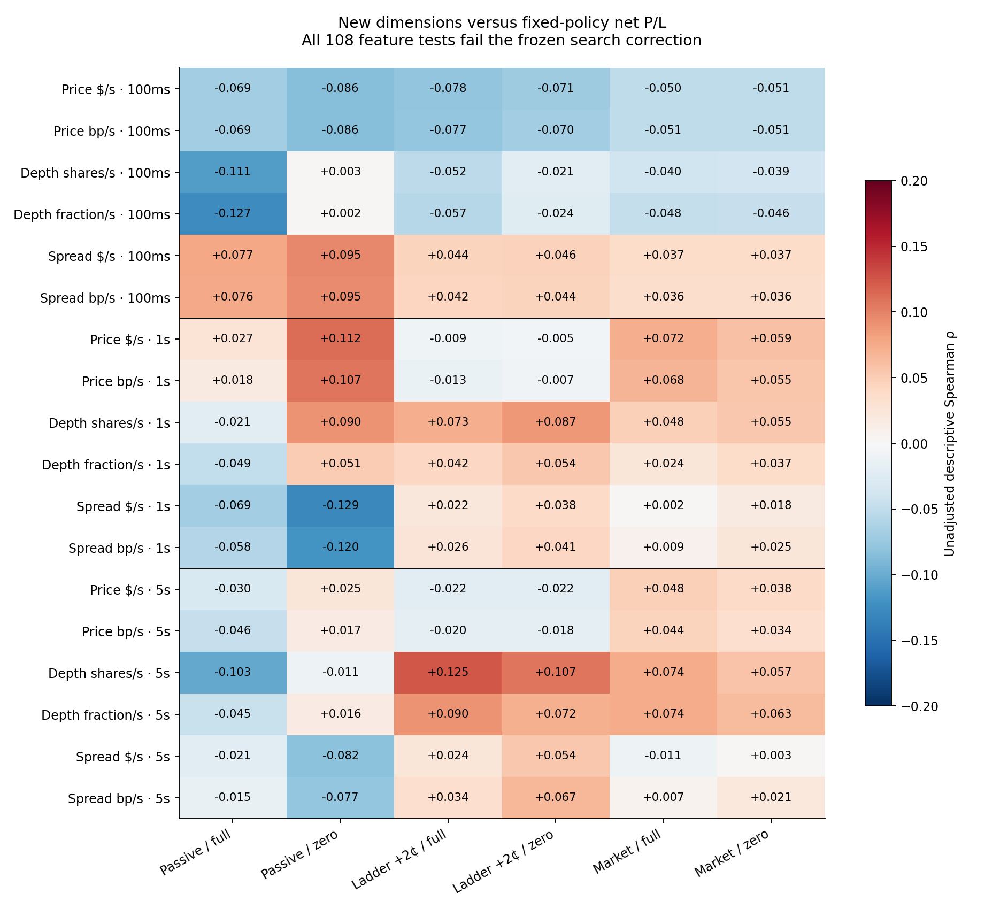
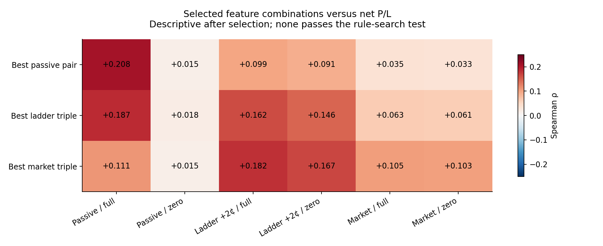
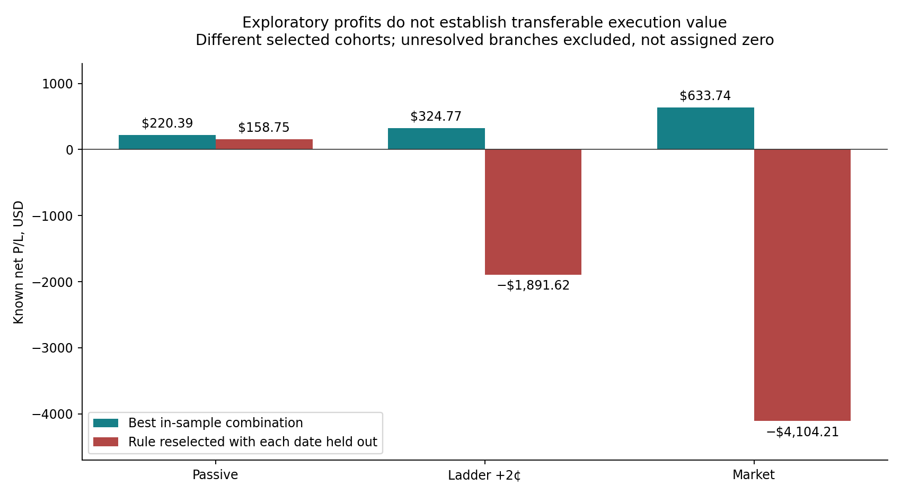

# New Dimension Correlation Report

**Result: no tested feature or combination qualifies at corrected p < 0.05.** All 244 candidates have complete causal features. Depth depletion is the strongest dimension for the primary passive execution outcome, but its relationship is weak. The best three-dimension ladder cohort is profitable in sample and loses money when the selection procedure is evaluated with each date held out.

The frozen search covers 18 features (three horizons × raw/scaled versions of three dimensions), 1,299 distinct rule cohorts and six fixed execution outcomes. Of those cohorts, 6,104 endpoint-specific rules meet the minimum of ten known candidates across three dates. No prior flow-intensity or toxicity feature is used for screening or selection.

## What is being predicted

A hit means **positive net P/L under one fixed execution policy**, using the strategy’s existing stops, targets and holding limits. This differs from the earlier “interior peak” or “zero-offset maximum” labels. The changed definition cannot itself establish a higher density of tradable edge. No-fill equals zero and is not a hit. Invalid branches remain unknown. No per-signal optimal offset enters a label.

Policies are post-only join, the frozen ladder with base +2¢ (children +2/+3/+4¢), and market entry. Ladder/market are diagnostic comparisons and do not satisfy passive-only entry. Feed latency remains 10 ms; entry reaches the venue 251 ms after decision. Maker fee is zero; taker fee is $0.003/share/leg. The two crossing-eligibility settings (full and zero) are structural execution stresses, not probabilities.

| Execution | Known / 244 | Positive | Filled | Known net P/L |
|---|---:|---:|---:|---:|
| Passive / full | 237 | 4 | 11 | −$682.48 |
| Passive / zero | 241 | 2 | 7 | −$108.31 |
| Ladder +2¢ / full | 233 | 53 | 154 | −$17,148.54 |
| Ladder +2¢ / zero | 239 | 56 | 157 | −$13,490.81 |
| Market / full | 240 | 79 | 240 | −$35,697.42 |
| Market / zero | 241 | 80 | 241 | −$35,171.67 |

These totals exclude unresolved branches; full-cohort P/L is unknown wherever any branch is invalid. All outcomes are simulated, not live fills.

## Causal definitions and units

Let `d = +1` for a proposed buy and `−1` for a sell, `c = decision − 10 ms`, and `h ∈ {0.1, 1, 5}` seconds. `m` is the midpoint derived from the reconstructed full book, `s` its spread, and `D_b`, `D_a` the displayed share totals across **every price level**.

- Price velocity: `P_h = d × [m(c) − m(c−h)] / h`, in USD/second. Its scaled companion is `10,000 × P_h / m(c−h)`, in basis points/second.
- Per-side net depletion: `L_j = D_j(c−h) − D_j(c) = Executions_j + Cancellations_j + ReplaceOut_j − Adds_j − ReplaceIn_j`, in shares over the window.
- Raw depth balance: `B_h = d × (L_a − L_b) / h`, in shares/second. Fractional depth balance: `F_h = d × [L_a / D_a(c−h) − L_b / D_b(c−h)] / h`, in inverse seconds.
- Spread dynamics: `S_h = [s(c) − s(c−h)] / h`, in USD/second. Its scaled companion is `10,000 × S_h / m(c−h)`, in basis points/second. Positive means expansion.

Raw values, side-specific components, full-depth levels and prior raw price volatility are retained separately. A cancellation is withdrawal, not trade consumption. Type P prints remain unsigned and do not reduce displayed depth; unassigned print volume is stored separately. Replacement outflow/inflow is recorded explicitly. Fixed full-book totals avoid artificial depletion from a moving depth band. This implementation does not test near-touch distance-weighted or queue-specific temporal depletion.

The extractor reconciled **33,225,736 pre-cutoff events** from **20,664,495,578 source bytes**. Every lifecycle, book total and best price matched the normalized source. Halt/auction epoch changes, invalid books, future timestamps or conservation failures invalidate a window. All 732 windows passed. Snapshots at the cutoff include messages at that timestamp and exclude every later message.

## Which dimension is strongest?

Primary endpoint: post-only join, full crossing eligibility, 237 valid outcomes. Within each dimension, the row below is the largest absolute date-centered rank correlation. Global Spearman values are shown separately. These coefficients measure association with net P/L; they are not calibrated prediction probabilities.

| Dimension / feature | Spearman ρ | Date-centered rank correlation | Nominal p | Within-endpoint search p |
|---|---:|---:|---:|---:|
| Price bp/s · 100ms | -0.0689 | -0.0569 | 0.3094 | 0.9791 |
| Depth fraction/s · 100ms | -0.1266 | -0.1109 | 0.0859 | 0.5307 |
| Spread $/s · 1s | -0.0694 | -0.0840 | 0.1880 | 0.8443 |

Depth ranks first for passive and ladder outcomes; price velocity ranks first for full-eligibility market entry. None is significant after correction. All-search p-values for these rows are 1.000 after accounting for the six endpoints and both testing families.

The [complete 24 × 24 matrix](full_correlation_matrix.png) includes feature-feature and outcome-outcome correlations. [Machine-readable coefficients and pair counts](correlation_matrix.json) retain the sample size for every cell.

## Feature combinations

Rules test both tails of the 10th/25th/50th/75th/90th feature percentiles, all single dimensions, all pairs, and triples at the same horizon. Identical memberships are deduplicated. Rule inference uses profitable-count enrichment conditional on each date’s number of wins, not the best realized dollar amount.

| Selected for | Total selected | Known | Wins | Known net P/L | Nominal p | Rule-search p | All-search p |
|---|---:|---:|---:|---:|---:|---:|---:|
| Passive / full | 11 | 10 | 2 | $220.39 | 0.0171 | 0.3245 | 1.0000 |
| Ladder +2¢ / full | 14 | 13 | 7 | $324.77 | 0.0055 | 0.3413 | 1.0000 |
| Market / full | 10 | 10 | 7 | $633.74 | 0.0153 | 0.6814 | 1.0000 |

All three selections use a five-second lookback. Exact stored thresholds:

- **Passive / full:** `price_bps_s_5s <= -0.467285891937565` AND `depth_fraction_s_5s <= -0.00666667583130294`.
- **Ladder +2¢ / full:** `price_bps_s_5s <= -0.467285891937565` AND `depth_fraction_s_5s <= -0.00197864731452175` AND `spread_bps_s_5s >= -0.00269257280716871`.
- **Market / full:** `price_bps_s_5s <= -0.467285891937565` AND `depth_fraction_s_5s <= -1.65976500364514e-05` AND `spread_bps_s_5s >= 0.0112701453848755`.

The ladder triple selects 14 candidates across six dates: 13 valid, 7 profitable, 2 losing, 4 unfilled, 1 unresolved. Known profit is **$324.765** with full crossing eligibility and **$186.352** with zero eligibility. Its price threshold means movement **against** the candidate direction; its depth balance is also negative. This is an exploratory reversal configuration, not evidence of continuation or informed-flow detection.

Under passive execution, that same triple produces only two positive fills and $220.392 known net profit; both fills disappear under the zero-eligibility stress. Their mean signed markout is **−$0.005/share at both 100 ms and 1 second**. Profitable strategy exits have not removed immediate adverse selection.

The [combination matrix](combination_outcome_matrix.json) is descriptive after selection. It does not provide a separate, uncorrected significance claim.

## Date-held-out behavior

For each date, quantiles and the enrichment-maximizing rule are learned on the other dates only. The chosen rule is then applied to that date. This evaluates a rule-selection procedure, so its selected cohort differs from the full-sample winner. The archive has already been explored; this is not a fresh prospective holdout.

| Training target | Held-out selected | Known | Profitable | Held-out known net P/L |
|---|---:|---:|---:|---:|
| Passive / full | 14 | 13 | 1 | $158.75 |
| Passive / zero | 79 | 78 | 0 | −$54.60 |
| Ladder +2¢ / full | 16 | 16 | 3 | −$1,891.62 |
| Ladder +2¢ / zero | 18 | 18 | 2 | −$1,864.06 |
| Market / full | 18 | 17 | 5 | −$4,104.21 |
| Market / zero | 17 | 16 | 6 | −$3,722.72 |

The passive full-eligibility procedure retains one profitable fill; its cross-stress economics and unresolved branch are recorded in [date-held-out validation](date_heldout_validation.json). A single surviving fill does not establish a multi-signal filter. The ladder and market selection procedures lose money with dates held out.

## Statistical controls and limitations

Each endpoint uses 9,999 shared within-date permutations (seed 20260927), including the observed arrangement via the plus-one correction. Feature tests use the maximum absolute date-centered rank correlation across all 18 features. Rule tests use the maximum standardized conditional excess-positive count across all eligible cohorts. Then Bonferroni ×12 covers six endpoints × two testing families. Even the within-endpoint corrections already reject every significance claim.

The audit independently checks rule scores against exact date-stratified hypergeometric convolution. A post-selection eight-date sign-flip sensitivity is recorded separately; its nominal result cannot rescue a rule selected on those same dates. Within-date label exchangeability remains an assumption, cross-symbol dependence remains a limitation, and eight convenience dates from a reused, survivorship-prone universe are inadequate to establish a systemic edge. These corrections cover the frozen new search, not the full historical sequence of research choices.

Methods references: [SciPy Spearman correlation](https://docs.scipy.org/doc/scipy/reference/generated/scipy.stats.spearmanr.html) and [permutation testing](https://docs.scipy.org/doc/scipy/reference/generated/scipy.stats.permutation_test.html). Permutation inference is used instead of relying on the small-sample asymptotic Spearman p-value.

## Signal refinement decision

**No production threshold is approved by this experiment.** Keep the new dimensions available for causal logging, but do not promote the discovered five-second thresholds into the autonomous entry gate. The candidate conditions above are frozen exploratory profiles, not validated entry rules.

The next qualifying evaluation must use previously untouched dates and a fixed execution policy, require positive net value under both execution stresses, demonstrate positive date-held-out results across multiple filled signals, and then run the full inventory/exits strategy replay. No additional tuning of these archived outcomes can substitute for that evidence.

## Artifacts and verification

- [Frozen protocol](analysis_protocol.json), [candidate features and outcomes](candidate_dimension_panel.jsonl), [rule family](rule_family.json), [all permutation results](permutation_results.json).
- [Independent audit](independent_dimension_audit.json): 732 causal windows, 733 cash ledgers, 1,464 frozen outcomes, 1,299 memberships, 108 correlations, 6,104 exact probability checks, 48 training-fold quantile checks and 576 matrix cells.
- 400 microstructure tests passed, including 12 new dimensional-pivot checks for units, cancellation versus execution, unknown signs, future-event isolation, malformed sources and training-label isolation.
- Execution outcomes were reused from audited frozen ledgers. This task did not change production strategy/execution code or submit orders.

## Ladder triple: complete selected membership

| Date | Symbol | Side | Full ladder net | Zero ladder net |
|---|---|---|---:|---:|
| 2019-07-30 | MRK | SELL | $229.00 | $229.00 |
| 2019-07-30 | O | BUY | $0.00 | $0.00 |
| 2019-12-30 | COP | SELL | −$158.40 | −$158.40 |
| 2019-12-30 | DD | SELL | $93.61 | $1.51 |
| 2019-12-30 | MRK | SELL | $171.50 | $171.50 |
| 2019-12-30 | SLB | BUY | $260.66 | $260.66 |
| 2019-12-30 | WMT | SELL | UNKNOWN | UNKNOWN |
| 2020-01-30 | DE | BUY | $0.00 | $0.00 |
| 2020-01-30 | GE | SELL | $39.98 | $39.98 |
| 2020-01-30 | SPG | SELL | $0.00 | $0.00 |
| 2021-07-13 | CVX | BUY | −$412.41 | −$412.41 |
| 2025-12-08 | FCX | SELL | $99.05 | $52.74 |
| 2026-06-12 | CVX | BUY | $1.77 | $1.77 |
| 2026-06-12 | ORCL | SELL | $0.00 | $0.00 |
