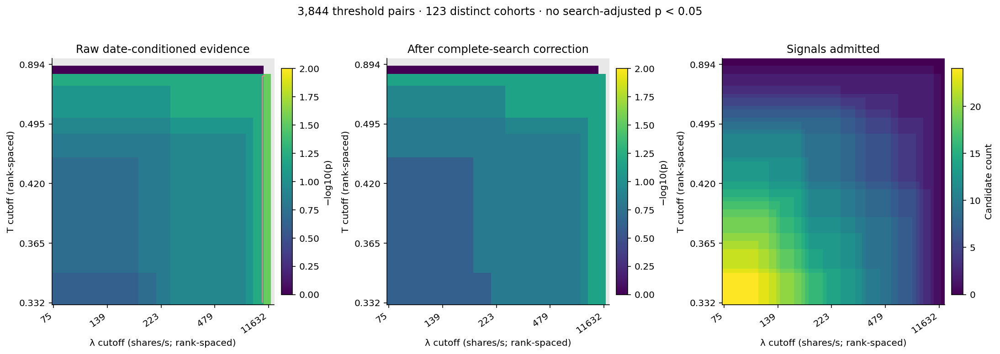
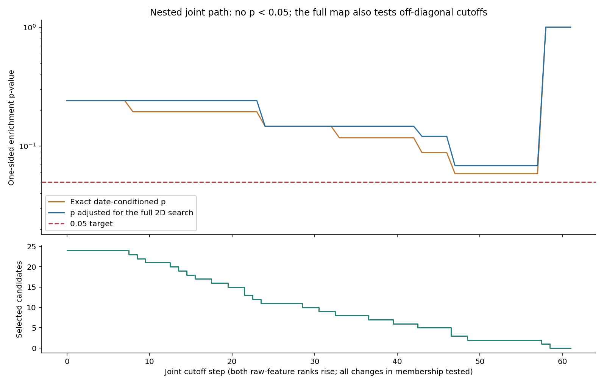
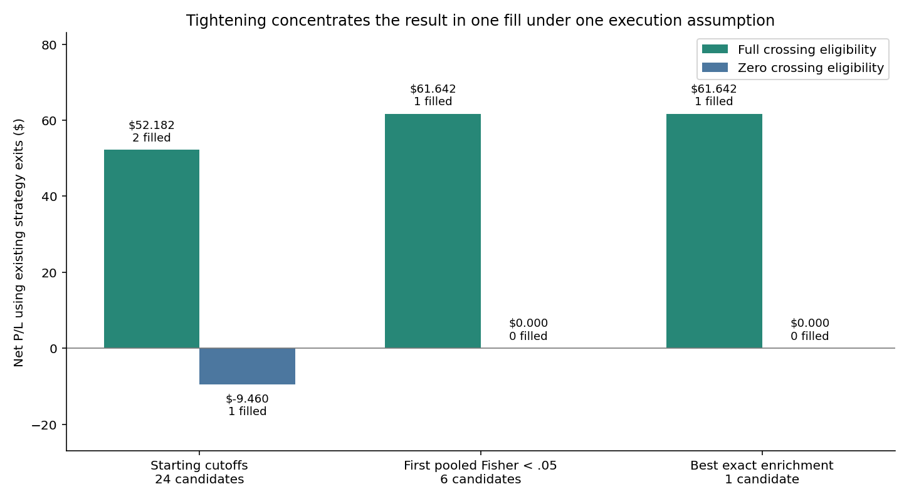

# Extreme Signal Profile

**No tested threshold meets p < 0.05 after correction for the complete tightening search.** The best historical fit isolates **one GE signal**, with raw date-conditioned p = **0.029412** and search-adjusted p = **0.068627**. Its passive net P/L is **+$61.642** under full crossing eligibility and **$0, no fill**, under zero eligibility.

The search covered all **244 frozen candidates**, **3,844 λ/T threshold pairs**, and **123 distinct admitted cohorts**. There are 209 known primary labels and 35 unresolved curves. Threshold equivalence eliminates duplicate tests without omitting a distinct selection. No new signals, exits, sizes, fees, latency settings, or execution assumptions were fitted.

## Exact thresholds and counts

Every rule requires raw total λ ≥ the stated cutoff (shares/s) AND signed-subset VPIN T ≥ the stated dimensionless cutoff. T is not a calibrated probability.

| Profile | λ minimum, shares/s | T minimum | Selected | Peaks / known labels | Pooled Fisher p | Exact date p | Search-adjusted p | Net, full eligibility | Net, zero eligibility |
|---|---:|---:|---:|---:|---:|---:|---:|---:|---:|
| Starting cutoffs | 74.846047006556 | 0.332156327746 | 24 | 1/20 (+4 unknown) | 0.182646 | 0.241830 | 0.241830 | $52.182 | $-9.460 |
| First pooled Fisher < 0.05 | 74.846047006556 | 0.541549880365 | 6 | 1/5 (+1 unknown) | 0.047387 | 0.088235 | 0.120915 | $61.642 | $0.000 |
| Best exact enrichment | 2748.023644609793 | 0.332156327746 | 1 | 1/1 (+0 unknown) | 0.009569 | 0.029412 | 0.068627 | $61.642 | $0.000 |

The earliest equivalent representative that **increases both cutoffs** is **λ ≥ 2748.02364460979 shares/s and T ≥ 0.334271052606051**. It selects the same GE candidate and has the same p-values and cash outcomes. Across the tested grid, 116 threshold pairs select that identical candidate. There is no uniquely identified decimal optimum.

For that joint representative, λ cutoffs in **(2365.17391280511, 2748.02364460979]** and T cutoffs in **(0.333398371868665, 0.334271052606051]** produce the identical per-axis selections on this dataset. Full-precision values and bounds are in `equivalent_joint_threshold.json`. These are empirical equivalence intervals, not confidence intervals for a population threshold.

The 1/1 historical hit rate is an observation about one admitted case. It does not estimate a dependable future success probability or prove that the rule has zero noise. Increasing a threshold beyond the last surviving positive observation removes the positive example; an empty cohort receives p = 1, never significance.

For a literal extreme corner, **λ ≥ 11632.375451441887 shares/s and T ≥ 0.7792103539469991** also select GE alone and produce the same statistics. Those cutoffs coincide with GE’s observed feature values. Increasing the numerical precision of that historical fit adds no independent evidence.

## Statistical contract

The target label is a **strict profitable single-order zero-offset maximum over the complete 0–427¢ curve**, under the full-eligibility scenario. The two positive labels are on different dates. Within those dates there are 34 and 18 complete curves, yielding **34 × 18 = 612** exact label assignments with the observed date-level positive counts fixed. All other dates retain zero positive labels.

For a fixed cohort r, H_r is its positive-label count. The one-sided date-conditioned p-value is the fraction of those 612 assignments with H_r at least as large as observed. To account for tightening, every one of the 123 cohorts is rescanned under every assignment. The adjusted p-value is the fraction whose **smallest** rule p-value is no greater than the observed rule p-value. The best result is exactly **42/612 = 7/102 = 0.06862745098**; its unadjusted date-conditioned value is **1/34 = 0.02941176471**.

The auxiliary pooled Fisher test ignores date stratification. For the isolated GE point it gives **2/209 = 0.00956937799**, explaining why a superficially impressive raw p-value can appear. P-values test enrichment of the historical curve label, not positive expected future trading profit. [SciPy Fisher exact documentation](https://docs.scipy.org/doc/scipy/reference/generated/scipy.stats.fisher_exact.html).

Exact enumeration uses every allowed assignment, including the observed one, rather than a sampled Monte Carlo correction. The null assumes label exchangeability within dates and fixes the missing-label mask. [SciPy permutation-test documentation](https://docs.scipy.org/doc/scipy/reference/generated/scipy.stats.permutation_test.html).

The earlier p = 0.3664 was a different, two-sided rank-association analysis adjusted across twelve feature tests. It is not directly comparable to the new one-sided threshold-enrichment tests. This search correction covers this newly frozen family only; it does not retroactively account for earlier universe, signal, feature or execution searches. All dates have been inspected before, so this remains exploratory evidence.

The plotted diagonal path raises both cutoff ranks together and never reaches even raw date-conditioned p < 0.05. The raw-significant singleton arises among off-diagonal combinations in the exhaustive two-dimensional map. Every path and equivalent cohort is included in the same search correction.

## Profitability and adverse selection

The isolated candidate is **GE, 2020-01-30, SELL**. Full-eligibility replay fills **1,666 maker entry shares**. Existing strategy exits produce **$66.640 gross − $4.998 taker exit fees = $61.642 net**. Under zero crossing eligibility it receives no fill and earns zero. There are no independent filled replications in this selected cohort.

Its entry markout is **−$0.005/share at both 100 ms and 1 s** (−$8.33 over the filled shares at each horizon; the two horizons must not be added together). Positive eventual exit P/L coexists with adverse short-horizon markouts. This result does not show that the Gatekeeper has solved adverse selection.

Measured pretrade features: λ_buy = 10,361.773153 shares/s, λ_sell = 0.000079133 shares/s, λ_unknown = 1,270.602220 shares/s, λ_total = 11,632.375451 shares/s; T = 0.779210354; signed coverage = 0.890770185. I = +0.999999985 and V_agg = +0.000001127156 /s. For the proposed SELL, side × I is approximately −1: signed flow is against the proposed position. The small measured imbalance velocity does not establish a velocity spike. The $0.006708 RMS price-change volatility remains a separate input.

Unknown-sign activity stays unassigned; the constant Nasdaq Type P B field is never treated as aggressor direction. These features and cash outcomes come from the already reconciled full-depth book and high-resolution tape replay.

## Robustness result

**None of the tightened cohorts contains a stress-persistent positive zero peak.** AMZN on 2025-12-09 is the only such positive case in the pool; its T = 0.196804620 is below the starting floor of 0.332156328. Raising that floor can never retain AMZN. All stress-label and both-stress-label tests therefore have p = 1.

Leave-one-date-out threshold selection recovers **0 of the 2 full-eligibility positives**, even if the best training rule is allowed without its significance gate. When GE’s date is excluded from training, the sole remaining positive is AMZN, which no admissible threshold can select. With corrected significance required, recovery is also 0/2. This diagnostic uses a full-pool feature grid and previously inspected dates; it is not an untouched prospective validation.

**Decision:** retain this as a one-candidate historical profile. There is no p < 0.05 search-adjusted threshold to report, no stress-robust laser trigger, and no production threshold release. The next confirmation requires new chronological data and a frozen rule; further tightening on these same observations does not create independent evidence.

## Reproducibility

`analysis_protocol.json` freezes the universe, floors, family, one-sided test, exact null and economic policy before the new scan. `threshold_family.json` enumerates every threshold pair and cohort alias. `exact_test_results.json` retains every p-value and every null minimum. `all_threshold_profiles.json` retains selected counts and both-policy/both-stress economics. `date_held_out_validation.json` retains every fold and prediction. `independent_extreme_audit.json` recomputes probabilities using rational hypergeometric convolution and independently recomputes execution cash. No live strategy was changed.
