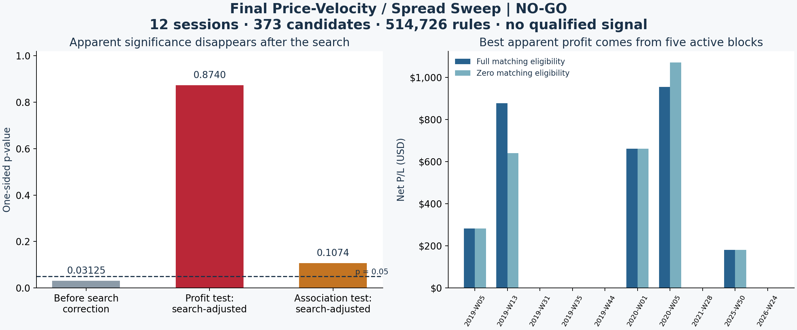

**Final Pivot — end of the road for this dataset**

**No price-velocity/spread rule passes the required p < 0.05 profit test.** The single final sweep is complete. Stop this research line on this dataset; do not deploy a rule from this search.

| Requested answer | Audited result |
|---|---|
| Entire dataset covered? | All **12 local Nasdaq sessions**, **52 strategy stocks**, **624 stock-days**, **373 candidates**. |
| Search intensity | **514,726 raw feature rules**, **124,888 distinct nonempty candidate sets**, three execution policies and both matching scenarios. |
| Best apparent net profit | **+$2,957.86** under full matching eligibility; **+$2,837.27** under zero eligibility. |
| Search-adjusted profit significance | Best corrected **p = 0.874023**, above 0.05. |
| Independent association check | Best corrected **p = 0.1074**, also above 0.05. |
| Qualified rules | **0**. |
| Final verdict | **NO-GO — no demonstrated price-velocity signal in this archive.** |

**What was tested**

Price velocity is `q × [m(t) − m(t−h)] / h`, with `q` equal to the existing candidate's side (+1 buy, −1 sell). Spread dynamics is `[s(t) − s(t−h)] / h`. The midpoint `m` and spread `s` come from full L3 order-lifecycle reconstruction. Both features retain USD/second values and separate bps/second versions divided by the starting midpoint. The model uses no λ/T inputs or depth-depletion thresholds.

Lookbacks are **100 ms, 1 s and 5 s**. The family contains every observed finite threshold, both inclusive ≥ and ≤ directions, each single feature, and every price/spread conjunction across all nine horizon pairs within each unit representation. Duplicate memberships are removed before outcomes are joined. All 373 candidates have valid features; every lookback stops at the decision's feed-visible cutoff, **10 ms before the decision**. Full depth conservation, trading continuity, auctions and unknown trade signs are checked by the existing reconstruction contract.

Passive posting, the existing two-cent ladder and market entry each use the original sizing, stops, targets, holding limits, **251 ms decision-to-arrival latency** and **$0.003 fee per taker share per leg**. Every candidate has six recorded execution branches (2,238 total). Both matching scenarios must have complete positive aggregate profit to qualify. Invalid selected outcomes remain unknown and make the affected rule/policy ineligible; they are never turned into zero P/L. No-fill outcomes remain zero.

There are **24,212 fully resolved rule/policy combinations**. Missing outcomes exclude the others from a complete profit claim. The test preserves those validity patterns during randomization rather than improving the data by dropping selected losers or unresolved positions.

**Why the profitable subset fails**

The maximum-profit rule uses `price_bps_s_1s` >= **0.905223137503** AND `spread_bps_s_5s` >= **0.165419130722**. These are side-aligned price velocity over one second and spread expansion over five seconds, both in bps/second. It selects **6 candidates across 5 sessions and 5 independent-test blocks**. It is a descriptive in-sample maximum, not a recommended trigger.

Its unadjusted profit p-value is **0.03125**. Searching the full declared family changes that to **0.874023**. Its conditional association p-value changes from **0.0008** to **0.1074**. Neither corrected result passes 0.05. Selecting this subset because its unadjusted p-value is small would repeat the original false-positive problem.

The strongest evidence rule selects 5 candidates and produces +$2,957.23 / +$2,836.64, with the same corrected profit p-value **0.874023**. The maximum-profit and strongest-evidence rules are recorded separately; neither passes.

| Execution policy | Maximum apparent net, full eligibility | Same rule, zero eligibility | Corrected profit p | Corrected association p |
|---|---:|---:|---:|---:|
| post_only:0 | +$57.80 | +$57.80 | 1.000000 | 1.0000 |
| ladder:2 | +$1,196.40 | +$1,090.87 | 1.000000 | 0.9800 |
| market | +$2,957.86 | +$2,837.27 | 0.874023 | 0.1074 |

**Statistical decision, frozen before the final feature/outcome join**

The primary test aggregates net P/L into **10 ISO-week blocks**; the three consecutive December 2025 sessions stay together. For each rule/policy and matching scenario it computes `sum(block P/L) / sqrt(sum(block P/L²))`, then takes the smaller of the two scenario statistics. It exhaustively evaluates all **1,024 block sign assignments** and compares the observed score with the maximum over the entire searched rule/policy family for each assignment. WAIT with zero profit is included. This retains within-block cross-stock dependence and corrects for choosing the best-looking rule.

This exact randomization calculation assumes independent block vectors that are symmetric around zero net profit under the null. It is conditional on that assumption, not a distribution-free guarantee. The sign-reversal mechanism is documented in the [SciPy permutation-test reference](https://docs.scipy.org/doc/scipy/reference/generated/scipy.stats.permutation_test.html); the need to account for the complete searched family is discussed by [White, *A Reality Check for Data Snooping*](https://doi.org/10.1111/1468-0262.00152). This implementation uses block sign flips, not White's bootstrap algorithm.

The secondary check runs **9,999 paired-outcome permutations**, restricted to the same session date and complete six-endpoint validity pattern. It moves all six execution outcomes together, repeats the full worst-scenario aggregate-profit search and uses a plus-one Monte Carlo p-value. This tests association under within-stratum exchangeability. Both tests had to pass; neither did. No threshold, lookback, policy or significance test was changed after seeing the sweep results.

**Verification and scope**

Independent audit: **PASS**. Rehashed all 12 raw archives, the 373 normalized candidate sources, cached inputs and all 1,189 distinct execution ledgers. Recomputed feature units and cutoffs, fill cash and fees, every raw membership, all integer block totals, all 1,024 sign-flip maxima without BLAS, and all **10,000 observed/randomized profit maxima using an independent C++ integer prefix-sum engine**. Test result: **459 passed in 8.73s**.

The archive contains sparse dated sessions, not continuous 2019–2026 history. It has already been explored, so this is not untouched prospective validation. Multiple-testing adjustment covers this complete final search, not every earlier research attempt. Full candidate positions and exits are simulated; shared portfolio capital allocation is not. The conclusion is **no demonstrated signal in this declared price/spread family on this data**, not a claim that every conceivable market strategy is impossible.

[Frozen protocol](analysis_protocol.json) · [Machine-readable decision](final_velocity_report.json) · [Independent audit](independent_final_velocity_audit.json) · [Rule family](rule_family.json) · [Descriptive correlations](descriptive_correlations.json)
