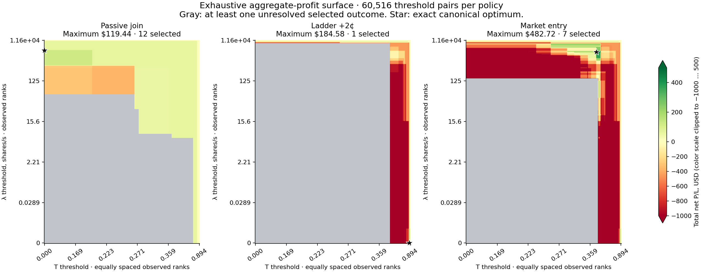
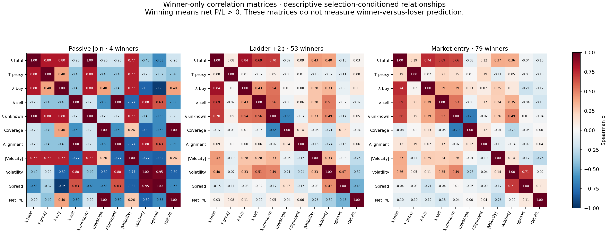
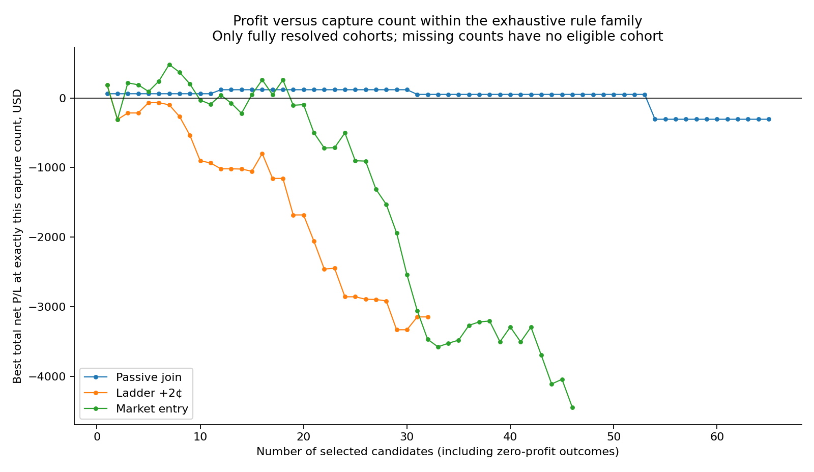
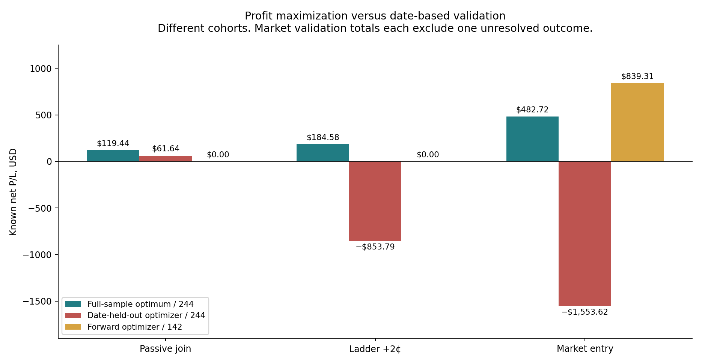

# Systemic Rule Report — Global Profit Maximization

**The automated sweep is complete: 60,516 λ/T pairs, representing 12,987 distinct cohorts, applied to all 244 signals.** No individual entry offsets were optimized. The primary passive-maker optimum is **λ ≥ 540.2556062311168 shares/s with T ≥ 0**, capturing **12 signals** for **+$119.444**. Toxicity adds no restriction at this optimum.

Across the three declared fixed execution policies, the highest fully resolved total is **+$482.724** with market entry, using **λ ≥ 511.2701343345897 shares/s AND T ≥ 0.39647101188332734**, capturing **7 signals**. This comparison requires taker entry and does not satisfy the passive-maker mandate. Neither result establishes a broad, independently validated system.

## Exact global optima

| Fixed execution | λ minimum, shares/s | T minimum | Captured | Wins | Losses | Zero P/L | Total net P/L | Net / all 244 signals |
|---|---:|---:|---:|---:|---:|---:|---:|---:|
| Passive join | 540.25560623111676 | 0 | 12 | 2 | 0 | 10 | $119.444 | $0.489525 |
| Ladder +2¢ | 0 | 0.89433469638503327 | 1 | 1 | 0 | 0 | $184.576 | $0.756459 |
| Market entry | 511.27013433458973 | 0.39647101188332734 | 7 | 4 | 3 | 0 | $482.724 | $1.978377 |

All selected outcomes in this table are resolved. Rejected signals contribute zero to the filtered fixed-candidate experiment, so the primary global denominator remains **244**, not just selected or filled trades. All P/L uses the existing strategy’s stops, targets, holding limits, position sizing and fees. The ladder is fixed at children +2/+3/+4¢; market entry consumes full available depth at the existing arrival time. No production execution code or live orders changed.

The thresholds are canonical representatives of observed membership intervals. They are not uniquely identified economic constants. There are 1,444 profit-maximizing threshold pairs for passive entry, 18 for the ladder and 14 for market entry. Ties maximize positive-outcome count, then minimize unknown/nonpositive/selected counts, then choose the lower cutoffs. This avoids inflating capture counts with extra unfilled candidates. [Exact machine-readable rules](discovered_rules.json) preserve full numeric precision.

## Profit objective and exhaustive-search certificate

For a fixed policy `p`, candidate `i` has frozen net cash `y_i(p)` and causal pre-trade features `(λ_i, T_i)`. The search solves:

`maximize over L, θ: Σ_i 1[λ_i ≥ L and T_i ≥ θ] × y_i(p)`

Cash is summed in integer USD 0.0001 units. The optimizer tests zero, every distinct observed feature value and an empty endpoint on each axis. Between adjacent observed values, membership cannot change; therefore finer decimal steps cannot improve this objective on this dataset. This is a global optimum **within the declared AND-of-two-upper-threshold family**, not across every possible Boolean rule, execution policy or future market.

Complete-profit optimization disallows a cohort with unresolved selected P/L. The runner also computes the unrestricted **known-cash** maximum and retains every unknown; the independent auditor checks all 60,516 memberships and 1,452,384 cash/count surface cells using direct membership × integer cash sums, independently of the suffix-sum optimizer. A WAIT option wins a nonpositive objective.

**Unresolved-outcome limitation:** the unrestricted market rule `λ ≥ 28.35101381904285 AND T ≥ 0.2874209841817137` captures 37 signals: 17 wins, 18 losses and 2 unresolved. Its known subtotal is **+$494.542** under full eligibility and **+$611.365** under zero eligibility. Its total P/L is **unknown**. Consequently +$482.724 is the largest fully resolved total, not a proven maximum over hypothetical values of missing outcomes. Neither missing trade is silently assigned zero.

## Winner DNA: all profitable signals, not a selected anecdote

A winner is strictly positive net P/L under its declared fixed policy. The full-eligibility pool contains **4 passive winners, 53 ladder winners and 79 market-entry winners**. These are overlapping policy-specific sets; their counts must not be added. No-fill is not a winner.

| Policy | Winner λ median | Nonwinner λ median | Winner T median | Nonwinner T median |
|---|---:|---:|---:|---:|
| Passive join | 273.258 | 5.8494 | 0.342102 | 0.242523 |
| Ladder +2¢ | 13.8267 | 5.14371 | 0.228117 | 0.257313 |
| Market entry | 16.3008 | 3.77599 | 0.23146 | 0.248648 |

For the broader ladder and market winner sets, median λ is higher than among nonwinners, while median T is lower. Winners nevertheless span almost the whole λ/T range. There is no universal “high λ plus high T” signature covering all profitable candidates. The passive subset has only four winners, so its apparent commonalities have very little support.

Winner-only Spearman correlations with **profit magnitude among winners**:

| Policy | Winner count | λ versus T | λ versus positive P/L | T versus positive P/L |
|---|---:|---:|---:|---:|
| Passive join | 4 | +0.8000 | -0.2000 | -0.4000 |
| Ladder +2¢ | 53 | +0.0821 | +0.0300 | +0.0802 |
| Market entry | 79 | +0.1883 | -0.0974 | -0.0990 |

These correlations describe winners after conditioning on winning. They cannot establish a classifier that separates winners from losers. The optimizer therefore scans the full 244-candidate population; the winner analysis does not remove losing examples or impose hand-picked threshold floors.

[Winner DNA data](winner_dna.json) contains all six policy/stress matrices: **29 × 29**, with per-cell counts, ten flow/context variables, eighteen price/depth/spread variables and net P/L. Constant or unavailable correlations are null. Raw intensity and volatility remain separate. No asymptotic correlation significance is claimed from the tiny winner subsets; see [SciPy’s small-sample Spearman guidance](https://docs.scipy.org/doc/scipy/reference/generated/scipy.stats.spearmanr.html).

An automatically derived rule that contains **every winner** uses the minimum winner λ and minimum winner T. Applied back to all 244 signals, this envelope yields the following results:

| Policy | Selected | Winners | Losses | Zero P/L | Unknown | Known total |
|---|---:|---:|---:|---:|---:|---:|
| Passive join | 135 | 4 | 5 | 122 | 4 | −$465.685 |
| Ladder +2¢ | 238 | 53 | 100 | 74 | 11 | −$17,023.061 |
| Market entry | 239 | 79 | 156 | 0 | 4 | −$33,212.926 |

The shared winner envelope admits substantial losing flow. Maximizing net dollars therefore sacrifices winner recall; it does not find one condition shared exclusively by all winners.

## Global stress and false positives

| Optimized policy | Captured | Full-eligibility net | Zero-eligibility net | Full zero-profit count | Full losing count | Nonpositive failure rate |
|---|---:|---:|---:|---:|---:|---:|
| Passive join | 12 | $119.444 | $57.802 | 10 | 0 | 83.33% |
| Ladder +2¢ | 1 | $184.576 | $184.576 | 0 | 0 | 0.00% |
| Market entry | 7 | $482.724 | $482.724 | 0 | 3 | 42.86% |

“Zero-profit” is reported separately from losses. The passive rule’s ten zero outcomes are all unfilled: **10/12 = 83.33%** of selected signals, or **10/244 = 4.10%** of the original pool. Under zero crossing eligibility, 11/12 are unfilled. The market rule has zero zero-profit outcomes but **3/7 = 42.86%** losing signals; reporting a 0% failure rate for it would conceal losses.

For the market rule’s λ cutoff alone, 14 signals qualify: 5 wins and 9 losses, with zero no-profit ties. Adding its T cutoff reduces this to 7 signals with 4 wins and 3 losses. For the passive optimum, T ≥ 0 changes nothing. These high-λ-only metrics are retained alongside joint-rule failure counts in [the numeric report](systemic_rule_report.json).

Optimizing the zero-eligibility total independently, or maximizing the minimum total across both structural stresses, gives the same canonical rule for each policy on this sample. The stress settings are alternative matching assumptions, not probabilities or independent replications.

## Validation of the optimizer, not just the selected rule

Every held-out fold refits the complete threshold grid on training features only and selects by training net dollars. Forward validation starts after the first three dates and evaluates the later five dates (142 signals). Leave-one-date-out evaluates all eight dates (244 signals). Full/zero stress results and a training-only policy selector are stored for both total-profit and max-min objectives.

| Policy | Date-held-out selected | Known net | Unknown | Forward selected | Known net | Unknown |
|---|---:|---:|---:|---:|---:|---:|
| Passive join | 9 | $61.642 | 0 | 3 | $0.000 | 0 |
| Ladder +2¢ | 3 | −$853.792 | 0 | 0 | $0.000 | 0 |
| Market entry | 16 | −$1,553.616 | 1 | 17 | $839.306 | 1 |

The passive date-held-out optimizer has one profitable fill under full eligibility and zero fills under the zero-eligibility stress; forward validation has no fills. The market optimizer’s forward known subtotal is positive, but one unresolved outcome prevents a total-profit conclusion, and its leave-one-date-out result is negative. The training-only policy selector chooses the same evaluated market cohorts. These mixed results do not establish a stable multi-signal edge. All dates have already been researched, so even forward reuse is not an untouched prospective test.

## Search-adjusted profitability check

As a secondary diagnostic, 1,999 randomizations shuffle paired full/zero outcome values within each date and validity-pattern stratum. Each draw repeats the entire threshold optimization. Missingness masks stay fixed. Reported tails include the observed arrangement with the plus-one correction, and an additional ×3 Bonferroni adjustment covers the policy comparisons. See [permutation-test methodology](https://docs.scipy.org/doc/scipy/reference/generated/scipy.stats.permutation_test.html).

| Policy | Threshold-search p | Including three-policy search |
|---|---:|---:|
| Passive join | 0.2235 | 0.6705 |
| Ladder +2¢ | 0.4105 | 1.0000 |
| Market entry | 0.4865 | 1.0000 |

Selection maximized dollars throughout; no stopping rule sought p < 0.05. None of the maxima is statistically exceptional under this conditional null. Exchangeability within date/validity strata is an assumption; cross-symbol dependence, eight convenience dates, survivor-selected stocks and the previous research history limit inference. These p-values do not retroactively account for every earlier strategy or feature search.

## Exact rule disposition

**Passive-maker research rule:** `λ ≥ 540.2556062311168 shares/s`; keep T as logged context, because its optimal floor is zero. This is the fully resolved, exhaustive in-sample profit maximizer for passive entry. It captures twelve candidates but only two positive fills.

**Largest fixed-policy comparison:** market entry with `λ ≥ 511.2701343345897` and `T ≥ 0.39647101188332734`, seven candidates, four winners and three losers, net +$482.724. It is a taker comparison, not a replacement passive entry gate.

Both are frozen research outputs. The completed optimization has identified exact sample maxima; it has **not** demonstrated a systemic production rule. Any promotion requires previously untouched sessions, resolution of material unknown execution branches, and a full inventory-constrained strategy replay. This report is fixed-candidate attribution and does not claim that simultaneous orders share unlimited buying power.

## Data contract and verification

- Features are causal at `decision − 10 ms` and match the original candidate cache. λ includes unsigned intensity; T is a signed-subset volume-imbalance proxy, not a probability. Nasdaq P prints remain unsigned. Coverage and unknown intensity are retained as separate DNA inputs; no fabricated aggressor side enters the sweep.
- All 733 distinct execution ledgers were hash-checked and cash-recomputed. The analysis reused the frozen full-depth execution outcomes with existing latency, queue, fill and exit assumptions.
- Independent audit: 60,516 memberships; 1,452,384 direct profit/count cells; 15 optimum profiles; 5,046 winner-correlation cells; 78 training-only global optima; and 48 independent diagnostic null rescans.
- 419 microstructure tests passed, including 19 optimizer tests covering exhaustive equivalence, unknown outcomes, integer cash precision, tie handling, no-fill abstention and held-out isolation. No production strategy/execution files changed.
- [Frozen protocol](analysis_protocol.json), [independent audit](independent_global_profit_audit.json), [all profit surfaces](all_profit_surfaces.npz), [validation](optimizer_validation.json), [machine-readable rules](discovered_rules.json).

