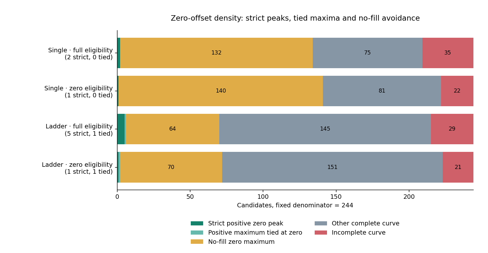
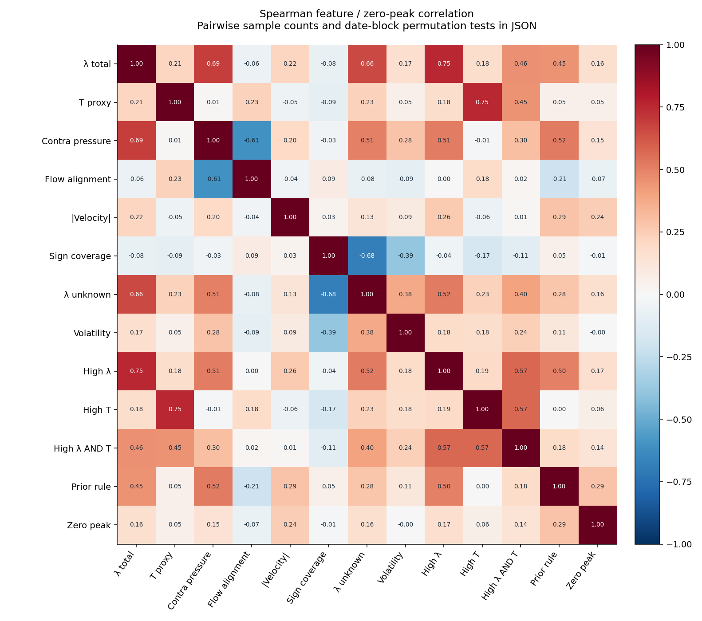
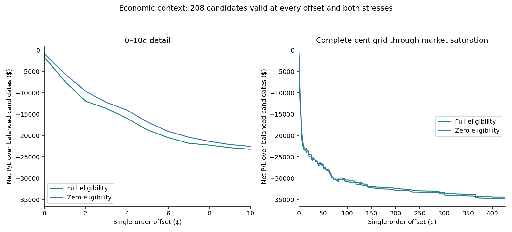
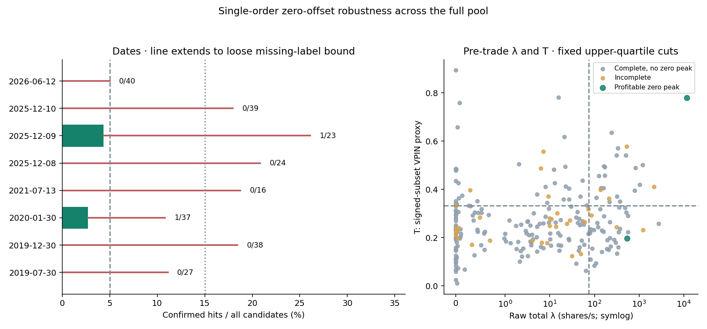

# Global Signal Density Report

**The zero-offset pattern is rare in this pool: 2/244 strict profitable peaks (0.82%), with 1/244 surviving both execution stresses.** The 215 candidates outside the previous 29-candidate single-order study add 0 confirmed peaks. This does not support scaling.

All **244 candidates** across **8 dates** were evaluated at every integer-cent offset from **0¢ through 427¢**, plus post-only and market controls. 7,517 new direct replays supplement checksum-verified prior ledgers; 418,704 candidate/policy/scenario rows cover two crossing-eligibility stresses.

**A no-fill zero is not a profitable signal.** A positive zero peak requires positive net P/L at zero and no higher P/L anywhere else on the complete curve. Ties and strict maxima are separate. Invalid outcomes remain unknown. This is a boundary maximum of a nonnegative aggression grid.

| Entry family / stress | Positive maxima including zero / 244 | Complete curves | Strict zero peaks | Fully flat positive curves | No-fill zero maxima | Unknown curves |
|---|---:|---:|---:|---:|---:|---:|
| single / full eligibility | 2/244 (0.82%) | 209 | 2 | 0 | 132 | 35 |
| single / zero eligibility | 1/244 (0.41%) | 222 | 1 | 0 | 140 | 22 |
| ladder / full eligibility | 6/244 (2.46%) | 215 | 5 | 1 | 64 | 29 |
| ladder / zero eligibility | 2/244 (0.82%) | 223 | 1 | 1 | 70 | 21 |
| passive_zero / full eligibility | 2/244 (0.82%) | 209 | 2 | 0 | 136 | 35 |
| passive_zero / zero eligibility | 1/244 (0.41%) | 222 | 1 | 0 | 145 | 22 |

**Both stresses agree on 1/244 profitable single-order zero peaks (0.41%)**, including 1 strict peaks. Full-eligibility peaks occur on 2 dates. The full-eligibility complete-case rate is 0.96% (2/209).

The `passive_zero` comparison replaces only the zero point by post-only:0 and retains the single-order +1¢…+427¢ alternatives. It has **1/244** profitable zero peaks confirmed in both stresses. It is a prespecified supplemental policy comparison, not an additional execution family.

**Strict single-order zero peaks: 2/244 (0.82%).** The broader registered label includes tied maxima, including 0 completely flat positive curves. Those flat curves show no offset advantage. 2 candidates have positive zero maxima and at least one worse aggressive offset. Use the strict count for a unique sweet spot, not the inclusive count alone.

The loose missing-label interval is 0.82–15.16%. Requiring positive observed zero-offset P/L tightens the identification interval to **0.82–4.51%**: a valid nonpositive zero cannot become a positive peak by resolving a different offset. These are identification bounds, not confidence intervals.

Date-cluster bootstrap 95% interval for the complete-case hit rate: 0.00–2.33%. Eight convenience dates and previous hypothesis search limit inference. The 5% / 15% decision bands describe frequency; neither is a test of profitability or a scaling criterion by itself.

There are 0 profitable zero peaks that become negative at +1¢; 0 have negative P/L at **every** strictly positive offset. A tied zero maximum does not establish the user's sharp-cliff pattern.

The two confirmed peaks remain profitable at +1¢: GE $61.642 → $39.984 and AMZN $57.802 → $56.042. The earlier selected-cohort aggregate cliff therefore does not imply a one-cent cliff in either winning signal. Its exact attribution is retained in `prior_cohort_cliff_attribution.json`.

Invalid curves reflect unresolved counterfactual execution or protection semantics, not an assumption that no trade happened. Their reasons and ledger references remain in the artifacts; several reasons can apply to one branch.

## Frozen λ / T comparison

High λ means **raw total rate ≥ 74.846047 shares/s**. High T means **signed-subset VPIN proxy ≥ 0.332156**. These are feature-only full-pool upper quartiles, fixed before the new sweep. T is not a probability; λ is not normalized imbalance. Unknown-sign volume stays separate, while total λ includes its measured activity.

The earlier 36% rule concerned an **interior ladder peak**, and used intensity plus contra-flow/depth pressure. It was not a high-T rule and did not predict this newly defined zero-peak label. Its held-out flags are retained only as a frozen comparison.

Both confirmed zero peaks have high λ, but only one has high T. None of the 12 feature/combination tests clears a 5% family max-statistic threshold. The very small number of positive labels makes these exploratory associations, not a reliable predictive filter.

| Feature group | Positive peaks / known labels | All candidates | Unknown labels |
|---|---:|---:|---:|
| high_lambda = 1 | 2/54 | 61 | 7 |
| high_lambda = 0 | 0/155 | 183 | 28 |
| high_T = 1 | 1/52 | 61 | 9 |
| high_T = 0 | 1/157 | 183 | 26 |
| high_lambda_and_T = 1 | 1/20 | 24 | 4 |
| high_lambda_and_T = 0 | 1/189 | 220 | 31 |
| prior_oof_intensity_and_depth_pressure = 1 | 2/22 | 28 | 6 |
| prior_oof_intensity_and_depth_pressure = 0 | 0/187 | 216 | 29 |

| Predeclared feature / combination | Spearman with zero peak | Date-block p | 12-test max-stat p |
|---|---:|---:|---:|
| lambda_total | 0.1621 | 0.0046 | 0.1634 |
| toxicity_proxy | 0.0521 | 0.4476 | 1.0000 |
| contra_pressure_per_s | 0.1483 | 0.0326 | 0.1822 |
| flow_alignment | -0.0696 | 0.3552 | 0.9180 |
| abs_velocity | 0.2448 | 0.0293 | 0.0728 |
| coverage | -0.0114 | 0.8530 | 1.0000 |
| lambda_unknown | 0.1588 | 0.0046 | 0.1646 |
| volatility_usd | -0.0024 | 0.9812 | 1.0000 |
| high_lambda | 0.1665 | 0.1042 | 0.1634 |
| high_T | 0.0571 | 0.4120 | 0.9966 |
| high_lambda_and_T | 0.1351 | 0.2438 | 0.3664 |
| prior_oof_intensity_and_depth_pressure | 0.2866 | 0.0410 | 0.0562 |

Strict-maximum sensitivity (descriptive; the table above tests the registered inclusive label):

| Group | Strict peaks / known labels | All candidates |
|---|---:|---:|
| high_lambda = 0 | 0/155 | 183 |
| high_lambda = 1 | 2/54 | 61 |
| high_T = 0 | 1/157 | 183 |
| high_T = 1 | 1/52 | 61 |
| high_lambda_and_T = 0 | 1/189 | 220 |
| high_lambda_and_T = 1 | 1/20 | 24 |
| prior_oof_intensity_and_depth_pressure = 0 | 0/187 | 216 |
| prior_oof_intensity_and_depth_pressure = 1 | 2/22 | 28 |

Spearman uses pairwise ranks; binary conjunctions test actual feature combinations. The machine-readable matrix includes every pairwise sample count. There are 4,999 label permutations within dates, preserving date-specific prevalence, and a maximum-absolute-correlation adjustment across the 12 prespecified tests. Within-date exchangeability is an assumption; this is an exploratory association analysis, not out-of-sample predictive validation. [SciPy rank correlation documentation](https://docs.scipy.org/doc/scipy/reference/generated/scipy.stats.spearmanr.html).

## Economics and execution meaning

| Zero-base policy / stress | Valid / 244 | Filled | Known net P/L | Entry taker shares |
|---|---:|---:|---:|---:|
| single / zero eligibility | 241 | 14 | $-902.023 | 2798 |
| single / full eligibility | 236 | 17 | $-1,761.102 | 2767 |
| ladder / zero eligibility | 239 | 129 | $-7,780.430 | 73506 |
| ladder / full eligibility | 231 | 127 | $-8,352.662 | 68657 |
| post_only / zero eligibility | 241 | 7 | $-108.305 | 0 |
| post_only / full eligibility | 237 | 11 | $-682.482 | 0 |
| market / zero eligibility | 241 | 241 | $-35,171.674 | 207406 |
| market / full eligibility | 240 | 240 | $-35,697.424 | 200587 |

Known P/L excludes invalid branches and is **not** full-pool realized profit when any branch is invalid. The chart uses the same complete candidate set at every offset and both stresses. These are independent candidate counterfactuals with existing strategy exits; no shared-capital portfolio simulation is claimed.

Single:0 is an ordinary limit at the decision-time join price; latency can make it marketable. Post-only:0 rejects marketable placement and is the passive-maker control. Ladder:0 splits quantity across 0¢, +1¢, +2¢ and can take liquidity. The former $507.466 result came from **CDE ladder base +1¢** in an earlier local experiment; it is not a zero-offset benchmark.

The replay preserves full-depth arrival pricing, queue priority, finite source execution budgets, 10 ms feed delay, 1 ms compute plus 250 ms outbound latency, one-second intent expiry plus cancel latency, maker fee zero and taker fee $0.003/share/leg, and the original stops/targets/holding limits. The crossing-eligibility stresses are structural scenarios, not calibrated probabilities. Nasdaq Type P remains unsigned; no constant B field is converted to aggressor direction.

## Confirmed single-order zero peaks

| Date | Symbol | Shape | Zero net P/L | +1¢ net P/L | Entry maker / taker shares |
|---|---|---|---:|---:|---:|
| 2020-01-30 | GE | POSITIVE_ZERO_STRICT | $61.642 | $39.984 | 1666 / 0 |
| 2025-12-09 | AMZN | POSITIVE_ZERO_STRICT | $57.802 | $56.042 | 176 / 0 |

**Release decision: research only; no scaling.** Use the confirmed and stress-persistent density, the missing-label bounds, and net execution value together. No new λ/T threshold is released from this sweep. A new chronological block with frozen signal and execution rules is required for a scaling claim. Completing invalid lifecycle branches takes priority over treating them as no fills.

Artifacts: `signal_classifications.jsonl` retains every candidate/family/scenario classification; `candidate_grid.jsonl` links every offset to its exact cash ledger; `arrival_saturation_proofs.json` certifies the saturated tails; `feature_correlation_matrix.json` contains correlations, counts and permutation statistics; `signal_density_report.json` contains date/sector densities and uncertainty. The separate independent audit records ledger, alias, label and source-markout checks.
