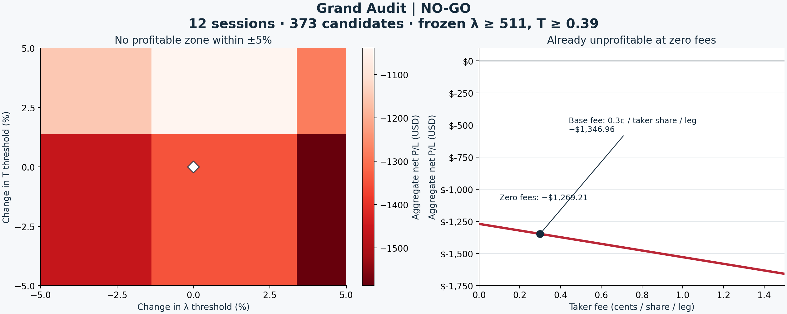

**Grand Audit — NO-GO**

The rule **λ ≥ 511 shares/second and T ≥ 0.39 fails the full-archive economic audit**. The earlier small-sample profit does not generalize to the remaining local sessions. Every parameter combination in the tested ±5% neighborhood is loss-making. **Do not deploy this rule.**

| Decision question | Audited answer |
|---|---|
| Empire or fluke? | The local result failed to generalize: **−$1,346.96** aggregate net P/L; 12 filled candidates, 4 winners and 8 losers. This is an economic rejection, not a new statistical p-value claim. |
| Robustness zone? | **No profitable zone: 0% width.** Across λ = 485.45–536.55 and T = 0.3705–0.4095, net ranges from **−$1,587.12 to −$1,039.03**. |
| Fee break-even? | **No nonnegative taker fee is profitable.** At zero fees the rule still loses **−$1,269.21**. |
| Final verdict? | **NO-GO**, before additional slippage is imposed. |

**Coverage and frozen execution**

All **12 of 12 local Nasdaq ITCH archive files** were included, spanning dated sessions from January 2019 to June 2026, with the existing **52-stock strategy universe plus QQQ context**. This is a sparse archive, not continuous calendar history or all Nasdaq symbols. Every one of the **624 strategy stock-days** is accounted for: **373 candidates**, **139 without a setup**, and **112 with an incomplete opening range**, which the unchanged strategy skips. No session was omitted. There are no unresolved selected execution branches.

The main result uses the **market-entry execution profile** behind the previously identified λ/T rule. Full-depth fills, original stops/targets/holding limits, position sizing and 251 ms decision-to-arrival latency remain fixed. Taker fees are the frozen model assumption of **$0.003/share on every taker entry or exit leg**, with zero maker fees. The two structural matching scenarios give the same main-rule P/L. These scenarios are matching assumptions, not probabilities.

| Archive contribution, requested rounded rule | Candidates passing | Net P/L |
|---|---:|---:|
| Original eight sessions | 8 | +$174.79 |
| Four remaining sessions, 129 additional candidates | 4 | −$1,521.76 |
| All twelve sessions | 12 | **−$1,346.96** |

The prior **+$482.72** result used the exact optimized thresholds **λ ≥ 511.2701343345897, T ≥ 0.39647101188332734**. The current command explicitly specifies **511 and 0.39**. That rounding adds one losing candidate in the original archive, changing its result to **+$174.79**. The audit uses the requested rule throughout; it does not substitute the old exact optimum.

**Parameter robustness**

The global baseline was completed before the sensitivity stage. The check covers **333 exact boundary representatives**, including both sides of each inclusive ≥ membership change, and a **41 × 41 display grid** at 0.25% increments. Those thresholds generate **6 distinct candidate sets**; repeated grid points are not independent observations. An independent midpoint-based enumeration recovered the same sets. All joint combinations are covered, not just single-axis changes or corners.

| λ threshold | T −5%: 0.3705 | T unchanged: 0.39 | T +5%: 0.4095 |
|---:|---:|---:|---:|
| 485.45 | −$1,459.44 | −$1,459.44 | −$1,151.51 |
| 511 | −$1,346.96 | −$1,346.96 | −$1,039.03 |
| 536.55 | −$1,587.12 | −$1,587.12 | −$1,279.19 |

Every exact tested set loses money. Adding **1¢ per taker share on each leg** beyond simulated depth VWAP changes the base result to **−$1,606.14**; the full neighborhood ranges from **−$1,839.46 to −$1,289.07**. This is a fixed-fill cash stress, not a claim about measured live slippage. The NO-GO verdict already holds at zero additional slippage.

**All-leg fee arithmetic**

Gross execution cash P/L = **−$1,269.21**. Taker volume across entries and exits = **25,918 shares**. Base modeled fees = **$77.754**.

`Net(f, s) = -1,269.210 − 25,918 × (f + s)`

Here `f` is the taker fee and `s` is extra execution cost, both in **USD/share/leg**; maker fees remain fixed at zero. At `s = 0`, the algebraic break-even fee is **$-0.048970213751/share/leg**: a required rebate of about **4.897¢ on every taker share**, rather than a tolerable positive fee. Thus removing the existing 0.3¢ fee cannot make the rule profitable. The root is verified with exact rational arithmetic.

**Passive control and scope of the P/L**

Using passive posting at the same base rule gives **−$311.46** under full crossing eligibility, and **$0 with no fills** under zero eligibility. The taker result does not establish a passive-maker edge.

Each candidate replay contains the full order lifecycle, inventory and original exits. Aggregation does not impose shared portfolio risk/capital allocation. Peak concurrent entry-cost exposure is **$150,628.66**, below the frozen $200,000 buying-power assumption; this diagnostic is not a portfolio replay. These totals are simulation cash results, not a live-account return.

λ remains raw volume intensity in shares/second. T remains the dimensionless signed-volume imbalance proxy; it is not a calibrated adverse-selection probability. Nasdaq Type P's constant B field is not treated as an aggressor sign. Unknown-sign activity and signable coverage remain separate inputs. No feature is read after its decision visibility cutoff.

**Verification and decision record**

Independent audit: **PASS**. Rehashed all 12 raw archives (83,160,933,276 bytes), all normalized source artifacts, candidate caches and execution inputs. Recomputed cash from actual buy/sell fill signs, checked flat terminal inventory, charged fees on all taker legs, and verified all parameter sets and stage ordering. Test result: **439 passed in 9.30s**.

The four remaining sessions are chronological backfill, not prospective evidence; the original eight were already used to discover this rule. No new significance claim or threshold optimization is used in this decision. The negative expanded economics and entirely negative local neighborhood are sufficient for **NO-GO**.

[Machine-readable result](grand_audit_report.json) · [Independent audit](independent_grand_audit.json) · [All-file inventory](inventory.json) · [Stock-day accounting](stock_day_accounting.json) · [Frozen protocol](analysis_protocol.json)
