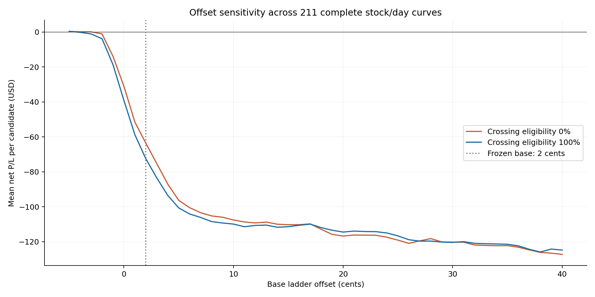
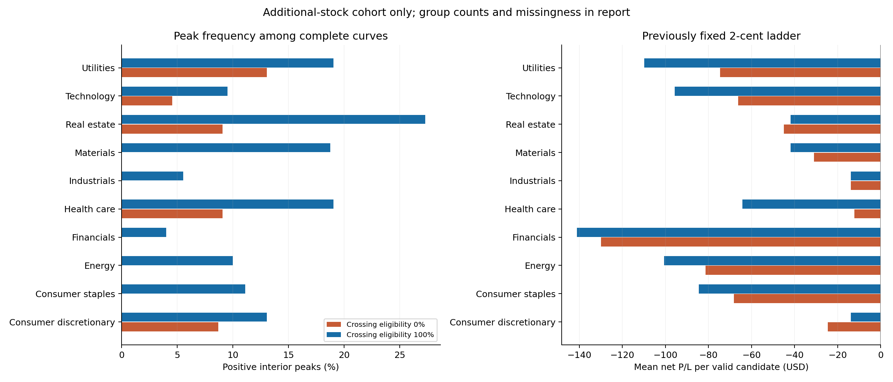
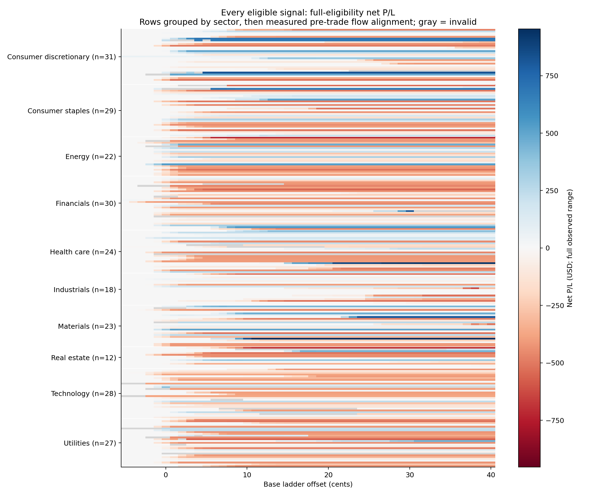
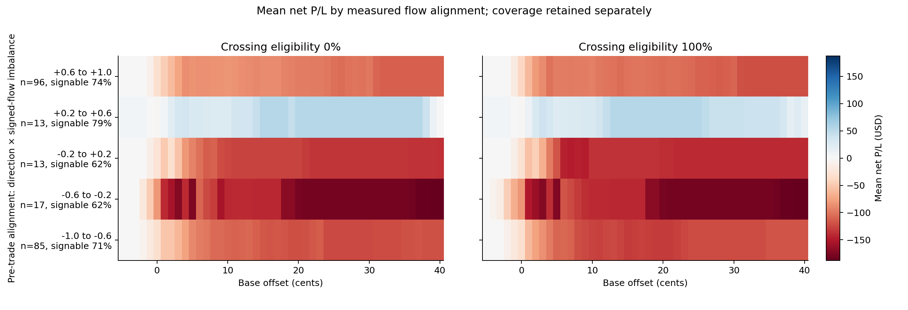

# Large-Scale Statistical Sweep

**244 eligible stock/day candidates from 244 signals, 52 stocks and 8 sessions.** The 23,424 parameter evaluations are repeated measurements, not independent signals.

The previously selected 2¢ ladder has negative average net P/L among valid additional-stock replays under both tested eligibility assumptions. This sweep does not support a global positive ladder edge.

## Frequency and fixed-policy value

| Cohort | Crossing eligibility | Candidates | Complete curves | Interior peaks | Peak frequency | Mean net at fixed 2¢ base | Date-cluster 95% interval |
|---|---:|---:|---:|---:|---:|---:|---|
| additional_universe | 0% | 233 | 210 | 9 | 4.3% | $-58.88 (229 valid) | $-94.66 to $-27.79 |
| additional_universe | 100% | 233 | 203 | 26 | 12.8% | $-76.29 (224 valid) | $-121.69 to $-38.04 |
| original_symbols | 0% | 11 | 10 | 1 | 10.0% | $-0.69 (10 valid) | $-124.15 to $130.12 |
| original_symbols | 100% | 11 | 9 | 2 | 22.2% | $-6.61 (9 valid) | $-147.39 to $140.25 |
| all | 0% | 244 | 220 | 10 | 4.5% | $-56.45 (239 valid) | $-91.95 to $-26.26 |
| all | 100% | 244 | 212 | 28 | 13.2% | $-73.60 (233 valid) | $-117.84 to $-36.53 |

A peak is a positive global maximum wholly inside −5¢ through +40¢, with lower valid results on both sides. A maximum touching a boundary is censored. Zero-fill outcomes contribute zero; invalid outcomes remain missing. Peak percentages use complete curves; the JSON includes all-candidate lower/upper frequency bounds. The 2¢ base was fixed from the previous experiment before these outcomes were evaluated. Per-signal best offsets are descriptive and are never added together as an executable strategy return.

## Execution controls and adverse selection

| Policy | Crossing eligibility | Valid / candidates | Filled candidates | Mean net per valid candidate | Signed markout, 100 ms | Signed markout, 1 s |
|---|---:|---:|---:|---:|---:|---:|
| post_only:0 | 0% | 241 / 244 | 7 | $-0.45 | $-0.02264/share | $-0.00441/share |
| ladder:2 | 0% | 239 / 244 | 157 | $-56.45 | $-0.01286/share | $-0.01288/share |
| market | 0% | 241 / 244 | 241 | $-145.94 | $-0.04241/share | $-0.04253/share |
| post_only:0 | 100% | 237 / 244 | 11 | $-2.88 | $-0.01011/share | $-0.00621/share |
| ladder:2 | 100% | 233 / 244 | 154 | $-73.60 | $-0.01333/share | $-0.01348/share |
| market | 100% | 240 / 244 | 240 | $-148.74 | $-0.04343/share | $-0.04355/share |

Markouts are share-weighted direction × (future midpoint − fill price); negative values are adverse. These are source-checked conditional fill measurements, not fitted probabilities. Control means include zero-fill valid branches and disclose invalid labels; differing valid subsets prevent treating raw mean differences as paired causal uplift.

## Sector comparison: additional stocks

| Sector | Candidates | Full-eligibility peaks / complete | Mean fixed-policy net, 100% | Mean fixed-policy net, 0% |
|---|---:|---:|---:|---:|
| Consumer discretionary | 26 | 3 / 23 | $-13.85 | $-24.60 |
| Consumer staples | 29 | 3 / 27 | $-84.43 | $-68.15 |
| Energy | 22 | 2 / 20 | $-100.54 | $-81.42 |
| Financials | 30 | 1 / 25 | $-141.07 | $-129.85 |
| Health care | 24 | 4 / 21 | $-64.26 | $-12.26 |
| Industrials | 18 | 1 / 18 | $-13.92 | $-13.92 |
| Materials | 17 | 3 / 16 | $-41.87 | $-30.93 |
| Real estate | 12 | 3 / 11 | $-41.91 | $-44.91 |
| Technology | 28 | 2 / 21 | $-95.66 | $-66.19 |
| Utilities | 27 | 4 / 21 | $-109.77 | $-74.65 |

## Volatility and decay

Volatility groups use only the pre-decision RMS of one-second price changes divided by the contemporaneous midpoint. Raw price volatility, raw flow intensity and signable coverage remain separate recorded inputs.

| Pre-trade volatility group | Candidates | Peaks / complete (100%) | Fixed-policy mean (100%) | Fixed-policy mean (0%) |
|---|---:|---:|---:|---:|
| Q1 | 49 | 4 / 46 | $-67.36 | $-60.09 |
| Q2 | 49 | 8 / 41 | $-109.47 | $-93.20 |
| Q3 | 48 | 2 / 40 | $-91.88 | $-72.40 |
| Q4 | 49 | 8 / 43 | $-48.20 | $-11.66 |
| Q5 | 38 | 4 / 33 | $-63.70 | $-58.54 |

| Crossing eligibility | Any positive offset / complete | Observed loss of profit right of peak | Median positive width around fixed base | Mean peak-to-right-edge decay |
|---|---:|---:|---:|---:|
| 0% | 69 / 220 | 2 | 40.5 cents | $2.49 per cent |
| 100% | 69 / 212 | 1 | 40.0 cents | $0.27 per cent |

Positive widths are conditional on profitability at the frozen base; intervals touching the tested boundary are censored. Decay is averaged only where a positive peak has tested offsets to its right. Every candidate’s one-cent P/L differences, positive-peak-normalized decay, first nonpositive offset to the right of its peak, and connected profitable interval around the frozen 2¢ base are in `signal_curve_statistics.jsonl`. A missing boundary means it was not observed within the tested range; it is not an extrapolated guarantee.

## Flow-alignment heatmap

The axis is the selected pre-trade alignment, direction × signed-subset imbalance. Unknown P-message volume stays unsigned. The heatmap data includes bin counts, valid counts and mean signable coverage; low coverage does not become a confident directional estimate. 20 candidates have undefined signed-flow imbalance and are omitted from these bins, while remaining in the full sweep.

## Data and execution scope

Sessions: 2019-07-30, 2019-12-30, 2020-01-30, 2021-07-13, 2025-12-08, 2025-12-09, 2025-12-10, 2026-06-12.

Sources: [Nasdaq public ITCH archive](https://emi.nasdaq.com/ITCH/Nasdaq%20ITCH/). Exact file identities, full-file checksums and lifecycle audits are preserved in `source_manifest.json` and the session manifests.

Full reconstructions cover 4,825,616,049 raw ITCH messages and 353,618,707 selected events. There are 107 stock/day slots with no setup, 65 slots excluded by pre-signal data requirements, and 0 signal intents rejected by the existing sizing/data adapter. 557 parameter rows have invalid execution labels; reasons are counted in the JSON.

Pre-signal exclusions retain their original reason codes. A fully reconciled single-venue feed can still have minutes without eligible prints; the inherited strategy requires all fifteen opening-range bars. Missing bars are not fabricated. These exclusions are separate from ordinary no-setup days.

All additional names use a research-only binding of the existing CDE methods: unchanged stop logic, 2R target and 180-minute holding limit. TSLA retains its 1.5R/2R tranches. Historical session bounds come from fully reconciled ITCH Q/M markers; the production calendar and deployed strategies are unchanged. Actual fill prices and timestamps drive exits. Each branch starts with the same $50,000 reference account, $375 stop-risk budget and $200,000 buying-power cap.

The fixed-candidate branches fully simulate their orders, inventory and exits. A capital-constrained multi-position portfolio replay remains a separate experiment. The prior $507.466 is a two-signal conditional result; its $0.043768 per-share/leg fee root is specific to a different saturated ledger.

## Limits on the conclusion

- Eight archive-availability dates, convenience universe and shared date risk; no untouched chronological holdout.
- Additional stocks use a research transport of CDE rules, not existing production strategies for those stocks.
- Fixed-candidate branch P/L with full actual-fill exits; simultaneous account capital, dynamic sizing and cross-position interactions are not simulated.
- Only displayed XNAS liquidity; no hidden liquidity discovery, consolidated routing, borrow availability or borrow cost model.
- Both crossing-eligibility endpoints are hypothetical fill-model assumptions, not estimated probabilities or bounds over all possible paths.
- Aggressive ladder children can take liquidity. Positive ladder results do not establish a passive-maker Gatekeeper edge.
- Fees fixed at $0.003 per taker share per leg and zero maker fee; no claim these equal historical account fee schedules.
- The earlier $0.043768 threshold belongs to one fixed saturated ledger; it is not a universal taker threshold.
- Peak frequency uses ex-post curves; deployable performance is reported separately at the previously frozen 2-cent base.
- Peak shapes combine quote prices, participation, queue assumptions, fees and inherited exit/risk rules; they do not isolate information asymmetry.
- No live feed/route compatibility or calibrated P(fill), P(adverse|fill), E(markout|fill) has been established.

The sweep measures the frequency and economics under declared assumptions. It does not establish a global market edge or a trained autonomous Gatekeeper.
