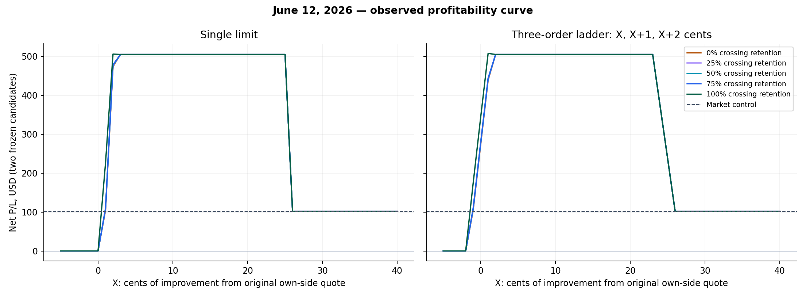
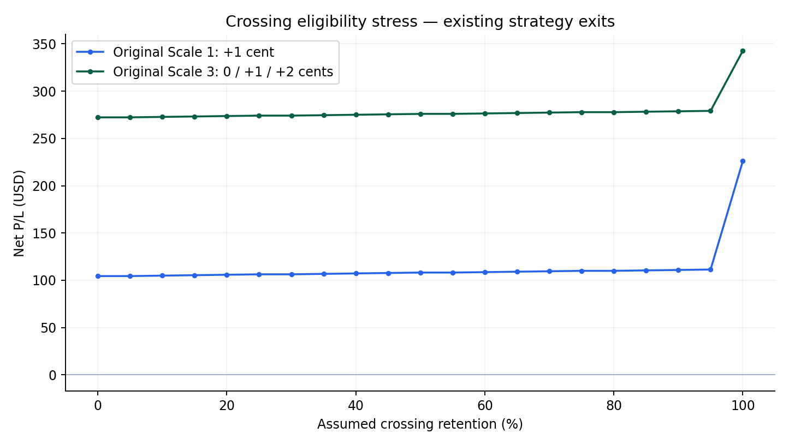
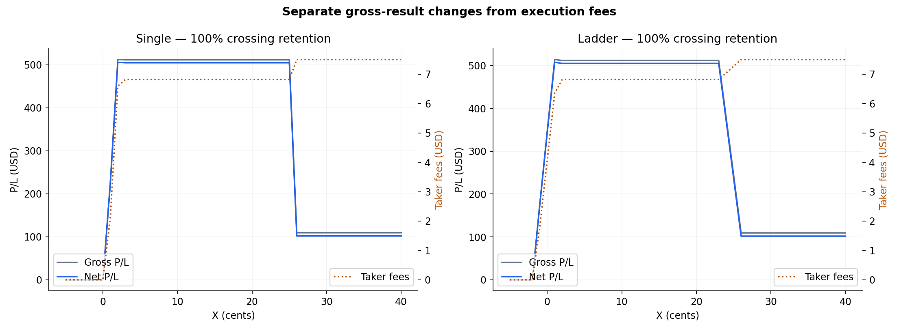

# Optimal Entry Report

June 12, 2026 — profitability peak and crossing-assumption sensitivity.

The highest modeled result is **$507.4660** for the ladder at **+1/+2/+3 cents**, with 100% crossing eligibility. The strongest worst-case result across the complete retention grid is **$504.7240**. Its least aggressive settings are **single at +3 cents or ladder at +2/+3/+4 cents**.

The experiment evaluates 1,974 portfolio settings (3,948 candidate settings) using the same two signals, quantities, latency and strategy exits. There are 191 explicit replays; other outcomes use verified execution equivalence or absence of any crossing-model trigger.

`X` is the integer number of cents of improvement from the original own-side quote. In dollars, limit price = original quote + direction × 0.01 × X, where direction is +1 for buys and −1 for sells. The ladder divides the original quantity over X, X+1 and X+2 cents. The grid runs from −5 through +40 cents in one-cent increments. Market IOC and original post-only controls are included.

| Family | Crossing retention | Best net P/L | All maximizing X values (cents) |
|---|---:|---:|---|
| single | 0% | $504.7240 | 3–25 |
| ladder | 0% | $504.7240 | 2–23 |
| single | 50% | $504.7240 | 3–25 |
| ladder | 50% | $504.7240 | 2–23 |
| single | 100% | $505.6860 | 2 |
| ladder | 100% | $507.4660 | 1 |

Best worst-case net P/L across all 21 retention settings: **$504.7240**.
Policies attaining that value: single X = **3–25 cents**; ladder base X = **2–23 cents**.

The per-symbol ledger in profitability_grid.csv identifies which signals each policy admits. The one-cent grid does not establish that these dollar offsets generalize to other signals or spreads.

| Original policy | Net at 100% | Net at 0% | Worst tested net | Maximum drop | Drop % | Positive throughout stress grid |
|---|---:|---:|---:|---:|---:|---|
| single:1 | $226.0320 | $104.4000 | $104.4000 | $121.6320 | 53.81% | True |
| ladder:0 | $342.6800 | $272.3020 | $272.3020 | $70.3780 | 20.54% | True |

The retention parameter is a deterministic stress assumption, not a fitted probability. At each crossing A/F, the engine previews the own fill under full matching and keeps floor(alpha × potential fill) per own order. The unavailable crossed quote remainder expires; the complete incoming residual then matches once in price/FIFO order. Existing fills remain positions and use the original exits. This conservative eligibility-loss convention makes zero-retention executable without leaving an impossible crossed book.

Taker-fee analysis uses Net(X, alpha, f) = Gross(X, alpha) − f × taker shares across entries and exits. Maker fees are zero. Gross execution prices already include spread and displayed-depth slippage. The fee grid spans $0 to $0.05 per taker share in $0.0005 increments; exact fixed-ledger break-even fees are in profitability_grid.csv.

| Family, 100% retention | First observed net decline | Gross change | Fee increase | Net change | Attribution |
|---|---|---:|---:|---:|---|
| single | 2 → 3 cents | $-0.7400 | $0.2220 | $-0.9620 | GROSS_CHANGE_AND_HIGHER_FEES |
| ladder | 1 → 2 cents | $-2.2800 | $0.4620 | $-2.7420 | GROSS_CHANGE_AND_HIGHER_FEES |

Fee-induced reversals on the complete stress grid: **0**. Gross changes also reflect which signals fill, fill quantity, price and exit timing; they must be separated from fees before naming a 'taker trap'.

Moving above the plateau that survives every retention setting:

- single X = 25 → 26 cents: net change **$-402.8040**, comprising gross change $-402.1200 and fee increase $0.6840. Per-symbol net change: {'TSLA': -402.804, 'CDE': 0.0}.
- ladder X = 23 → 24 cents: net change **$-133.7180**, comprising gross change $-133.4900 and fee increase $0.2280. Per-symbol net change: {'TSLA': -133.718, 'CDE': 0.0}.

Every point on this robust plateau fills CDE and leaves TSLA unfilled. The large deterioration above it comes from adding TSLA exposure, whose realized loss is much larger than the incremental fees. This is an in-sample exposure-selection result.

Interpretation and verification:

- A set of maximizing prices is reported when the curve has a plateau. One-cent resolution identifies exact tested ticks; it does not identify an arbitrary continuous optimum.
- Once every child fills the same total quantity at arrival, widening the price limit consumes the same depth and leaves the same cash, inventory and book. A more permissive limit does not automatically pay its limit price. Saturated controls are directly replayed at both stress endpoints.
- The original four conditional-scale results must match the earlier audited replay exactly. The market control is directly replayed at zero retention to verify its invariance.
- The full cache reconciles 34,290,245 source events. Individual policies use the exact pre-decision L3 snapshot and event tail through their terminal orders, exits and fill markouts; they do not replay unrelated symbols or the inactive remainder of the day.
- Fees remain research assumptions: $0.003 per taker share and $0 maker fee in the primary result. Borrow, regulatory, brokerage and financing costs remain excluded. Native stop-processing delay is zero; ordinary outbound and cancellation latency is 250 ms plus 1 ms computation, with 10 ms reports.
- This is fixed-candidate attribution with full position exits. Later quantities are not resized against a changing capital ledger. The crossing stress is a model scenario, not verified venue routing or an estimate of historical fill probability.
- The effective number of independent signals remains two. This same-session optimization is in-sample selection and does not establish out-of-sample profitability or a live optimum.
- Invalid grid points: 0. Execution budgets, order quantities, and cash are preserved in executed_runs; aggregate results and fee surfaces are supplied as CSV files.
- Sweep runtime: 301.47 seconds, excluding the separately validated full-source cache build.
