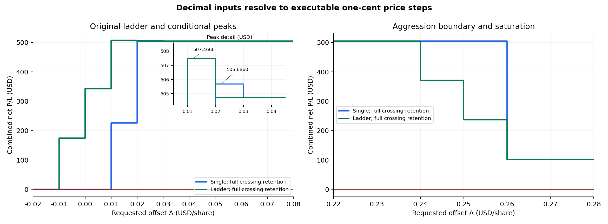
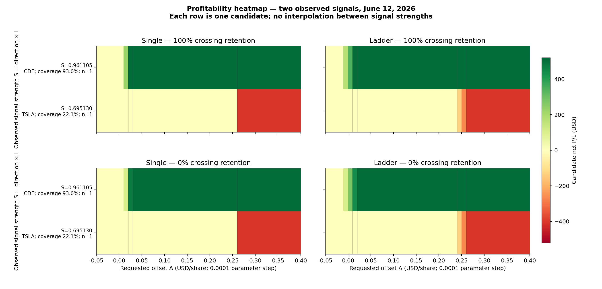
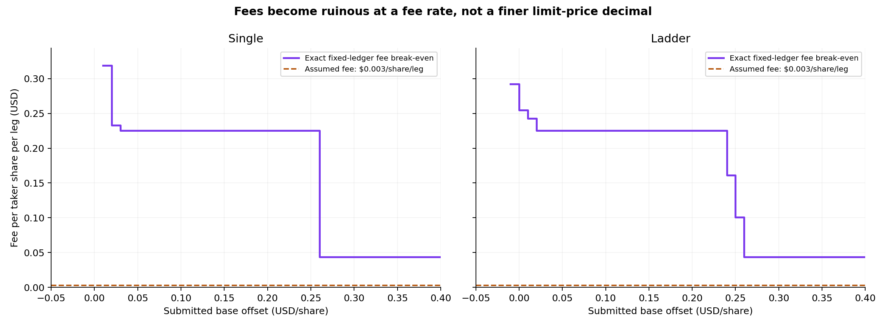
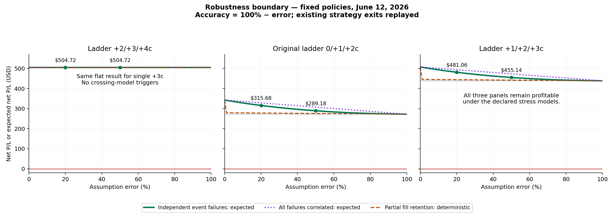

# Micro-Grid Precision Optimization Report

June 12, 2026 development session. TSLA and CDE candidates, sizes, timestamps, latency and existing strategy exits remain fixed. Signal strength is the user-selected pre-trade flow alignment S = d × I.

**There is no hidden executable sub-cent peak for these plain-limit policies.** The prior price sweep already used every legal one-cent tick. The new parameter sweep evaluates $0.0001 increments and explicitly resolves them to submitted tick prices; all decimals in the same rounding interval produce identical orders.

The conditional maximum remains **$507.4660** at a **$0.01 ladder base** (children +$0.01/+$0.02/+$0.03). The previously audited crossing-robust plateau remains **$504.7240**, beginning at single +$0.03 or ladder base +$0.02. No global or out-of-sample optimum is established.

The experiment expands **9,002 decimal parameter settings** into **18,004 candidate evaluations**, backed by 92 unique legal policies and **104 fresh complete candidate replays** around the peaks, the cliff, and a +$1.00 saturation control. These counts are not new independent signals.

## Price precision and exact admissible maxima

The Nasdaq definition for these >=$1 plain-limit stocks specifies a $0.01 increment. The SEC’s June 11, 2026 order deferred the amended Rule 612 requirements until November 2027. This is the rule context for the June 12 historical session. [Nasdaq Equity 1, Section 1(a)(13)](https://listingcenter.nasdaq.com/assets/RuleBook/Nasdaq/rules/Nasdaq%20Equity%201.html), [SEC Release 34-105656](https://www.sec.gov/files/rules/exorders/2026/34-105656.pdf).

A $0.0001 ITCH price field specifies representation precision; it does not make a $0.0001 explicit quote increment executable. This experiment concerns plain limit orders, not derived midpoint or other special order types.

The declared agent-side conversion is k = floor(Δ / $0.01). Submit p = original own-side quote + d × k × $0.01, with d = +1 for BUY and −1 for SELL. Ladder child i adds i further ticks. This rounds BUY prices down and SELL prices up, without exceeding requested aggression. Direct explicitly priced off-tick orders fail validation and have no hypothetical fill P/L.

The parameter domain is −$0.05 through +$0.40 inclusive in $0.0001 steps. Of its 9,002 family/offset pairs, 8,910 would be rejected if submitted directly as explicit prices. Their reported rounded-policy P/L comes only from valid one-cent quotes.

| Family | Crossing retention | Maximum net P/L | Submitted base offsets (cents) | Decimal parameter interval |
|---|---:|---:|---:|---|
| single | 0% | $504.7240 | 3–25 | [0.03, 0.26) USD |
| single | 100% | $505.6860 | 2 | [0.02, 0.03) USD |
| ladder | 0% | $504.7240 | 2–23 | [0.02, 0.24) USD |
| ladder | 100% | $507.4660 | 1 | [0.01, 0.02) USD |

Intervals are lower-inclusive and upper-exclusive under the declared rounding policy. They identify equivalent input parameters, not a continuum of executable prices. For example, ladder Δ = $0.0100 through $0.0199 submits the same +1/+2/+3c ladder. Its extra decimals cannot change fees or profits.

The $342.68 original ladder at base Δ = $0.00 is not a local maximum: the already measured adjacent bases −$0.01 and +$0.01 yield $174.3910 and $507.4660 under full crossing retention.

## Profitability heatmap: offset × observed strength × net P/L

X is the requested USD offset; Y contains the two actual pre-decision flow-alignment values; color Z is the corresponding candidate’s net P/L after modeled fees and original exits. Each row has n = 1 historical signal. No intermediate strength values, altered tape, or scaled signal profits are invented. Different instruments and sizes confound any apparent strength/profit relationship; this is an observed conditional map, not a fitted strength-response surface.

| Candidate | S = dI | Signable coverage | Unknown activity | Possible all-flow S interval | Raw total intensity (shares/s) | Volatility (USD) |
|---|---:|---:|---:|---|---:|---:|
| TSLA | 0.695130 | 22.14% | 77.86% | [-0.624624, 0.932489] | 370.952631 | 0.179839 |
| CDE | 0.961105 | 92.96% | 7.04% | [0.822990, 0.963844] | 318.129038 | 0.004916 |

I = (λ_buy − λ_sell)/(λ_buy + λ_sell), using signable volume rates. S is dimensionless; raw buyer/seller/unknown rates remain in shares/second, imbalance velocity in 1/second, spread and volatility in USD. All feature snapshots precede order decisions. The original strategy confidence is 1.0 for both signals and cannot supply a variable confidence axis.

TSLA’s low signable coverage makes its signed-subset alignment particularly uncertain: assigning the unknown volume differently can reverse the all-flow sign. Nasdaq P-message direction remains unknown; the heatmap never assigns it a buy or sell sign.

## Edge of ruin and transaction-cost attribution

**Positive-to-negative combined P/L transitions from increasing Δ: 0. Fee-only offset reversals: 0.** The tested aggression cliff does not cross zero. It mainly adds losing TSLA exposure; it is not evidence that a marginal extra fee killed an otherwise unchanged signal.

| Family | Offset transition | Gross P/L change | Fee increase | Net P/L change | Result after transition |
|---|---|---:|---:|---:|---:|
| single | 2c → 3c | $-0.7400 | $0.2220 | $-0.9620 | $504.7240 |
| ladder | 1c → 2c | $-2.2800 | $0.4620 | $-2.7420 | $504.7240 |
| single | 25c → 26c | $-402.1200 | $0.6840 | $-402.8040 | $101.9200 |
| ladder | 23c → 24c | $-133.4900 | $0.2280 | $-133.7180 | $371.0060 |
| ladder | 24c → 25c | $-133.7600 | $0.2280 | $-133.9880 | $237.0180 |
| ladder | 25c → 26c | $-134.8700 | $0.2280 | $-135.0980 | $101.9200 |

Full-parent immediate execution saturates at TSLA +26c for both families, CDE +3c for single orders, and CDE +2c for ladders. Beyond combined saturation at +26c, further valid price aggression consumes the same displayed depth prefix with the same quantity, entry VWAP, time and exits. The combined result remains $101.9200; the fresh +$1.00 controls confirm it. This supplies a saturation argument rather than assuming an unseen ruin point beyond the plotted domain.

The exact fee boundary is a separate variable: Net(f) = G − f × N_taker, where G is gross USD P/L and N_taker counts taker shares on **both entry and exit**. With zero maker fee and fixed execution behavior, f_BE = G/N_taker. This is an exact rational root before fee-rounding conventions; it does not estimate actual broker pricing.

| Fixed ledger, full crossing retention | Gross P/L | Taker shares, both legs | Break-even fee (USD/share/leg) | Current assumed fee |
|---|---:|---:|---:|---:|
| $504 plateau | $511.5400 | 2272 | 0.225149647887 | $0.003 |
| Original $342 ladder | $346.7600 | 1360 | 0.254970588235 | $0.003 |
| Conditional $507 ladder | $513.8200 | 2118 | 0.242596789424 | $0.003 |
| Saturated combined exposure | $109.4200 | 2500 | 0.043768000000 | $0.003 |

Each root is stored as an exact numerator/denominator. Substituting it gives net P/L exactly zero; moving the fee one millionth of a dollar/share above or below reverses the sign. There is no numerical optimizer tolerance or invented sub-cent execution behind these fee roots.

## Refined robustness boundary: every 1% error increment

The preceding robustness experiment already evaluated error rates 0%, 1%, …, 100%. This report revalidates and carries forward its complete 606 independent-event expectation points and 606 deterministic-retention points, along with the exhaustive event-path support certificate. Replaying identical orders at additional decimal parameters cannot introduce a different error curve.

| Fixed policy | Net at 0% error | Expected net at 20% error | Expected net at 50% error | Net at 100% error | Crossing fragility / 100 |
|---|---:|---:|---:|---:|---:|
| single:3 | $504.7240 | $504.7240 | $504.7240 | $504.7240 | 0.00 |
| ladder:2 | $504.7240 | $504.7240 | $504.7240 | $504.7240 | 0.00 |
| ladder:0 | $342.6800 | $315.6826 | $289.1824 | $272.3020 | 20.54 |
| ladder:1 | $507.4660 | $481.0594 | $455.1391 | $438.6280 | 13.57 |

**The $504.724 profit disappears at no error percentage in the admissible 0–100% crossing-error domain.** The reason is structural: those policies have no uncertain crossing-model fills. Every terminal event path for the six previously stressed policies also remains net positive under the declared quote-eligibility-loss model. A universal error tolerance for latency, routing, hidden liquidity, fees or future signals does not follow.

Intermediate expected values use independent Boolean crossing-event failures; common failures and partial share retention remain separate scenarios in the prior robustness report. None of these assumptions are empirically calibrated fill probabilities.

## Verification and scope

- 104 fresh complete replays include every cent in the local −2c…+8c and +22c…+28c neighborhoods, +40c/+100c controls, and decimal parameters immediately around the important tick boundaries. Actual paid prices, fill times, liquidity roles, quantities and exits match the original audited ledgers.
- All 9,002 parameter pairs are checked for order-price and quantity equivalence. Direct off-tick prices fail validation; no non-executable quote receives a fictitious profit. The machine-readable expansion is [micro_offset_grid.jsonl](micro_offset_grid.jsonl), and exact heatmap values are in [heatmap_data.json](heatmap_data.json).
- Full L3 snapshots and source event tails drive execution. Per-order lifecycles, market-order depth budgets, unknown signs, inventory and existing exits remain intact. Sources and code are hash-pinned in [precision_report.json](precision_report.json).
- Independent checks are recorded in [independent_precision_audit.json](independent_precision_audit.json): decimal-to-tick mappings, cash/share accounting, candidate strength provenance, exact fee roots, depth saturation and reuse of the full 1% error grid.
- The primary fee scenario remains $0.003 per taker share per leg, maker fee zero; borrow, regulatory, financing and other broker fees remain excluded. Ordinary order computation/outbound latency is 1 ms + 250 ms; reports are 10 ms; native stop delay remains the earlier zero-delay assumption.
- The conditional peak depends on the declared crossing model; the $504 plateau comes from a CDE taker entry and exit while TSLA stays unfilled. Two in-sample signals and repeated parameter evaluations do not establish a passive-maker edge, a calibrated toxicity predictor, statistical robustness or live profitability.
- Fresh replay and analysis runtime: 176.61 seconds, excluding the already completed source reconstruction and 1% robustness experiment.
