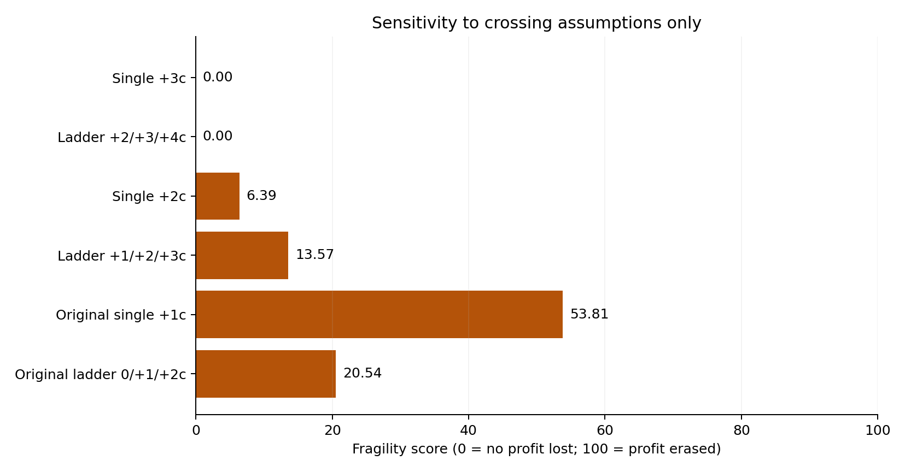

# Robustness Boundary Report

June 12, 2026 development session. Two frozen candidates: TSLA and CDE. Six fixed policies. No new entry-price optimization.

**The $504.7240 plateau does not decay when the crossing assumption fails. It remains $504.7240 at 80%, 50%, and 0% assumed accuracy.** Neither primary policy invokes the uncertain crossing-fill model. Both fill CDE as a taker and leave TSLA unfilled.

**Break-even error rate: not reached anywhere in the admissible 0–100% error interval.** The maximum certified error for this specific scenario is 100%; that is not a break-even estimate, an empirical accuracy measurement, or a general safe operating limit.

**Primary fragility score: 0.00/100 — insensitive to the tested crossing assumption.** This score describes this assumption and these candidates only. The $504 result is a taker execution result, so it does not establish an edge for the original passive-maker Gatekeeper.

## Event-accuracy experiment

An “incorrect crossing assumption” means an A/F residual cannot provide the modeled own fill. On failure, affected quotes lose eligibility before the source residual is matched; their remaining shares expire using the previously declared zero-retention convention. Existing fills stay in inventory and follow the original stops, targets and holding limits. No realized P/L is scaled after the fact.

For each dynamically reachable crossing event, all ladder children share one Boolean result. Every branch is replayed, including events that appear only after earlier choices. Let e be the scenario error probability, a = 1 − e, and let a terminal path have s successes and f failures. Under independent event failures its probability is a^s e^f; the expected net result is the sum of path probability × full replay net P/L. Path probabilities sum to one exactly using rational arithmetic. No Monte Carlo sampling is used.

| Fixed policy | 100% accuracy | 80% accuracy | 50% accuracy | 0% accuracy | Worst possible event path | Fragility / 100 |
|---|---:|---:|---:|---:|---:|---:|
| Single +3c | $504.7240 | $504.7240 | $504.7240 | $504.7240 | $504.7240 | 0.00 |
| Ladder +2/+3/+4c | $504.7240 | $504.7240 | $504.7240 | $504.7240 | $504.7240 | 0.00 |
| Single +2c | $505.6860 | $495.1630 | $483.1805 | $473.3480 | $473.3480 | 6.39 |
| Ladder +1/+2/+3c | $507.4660 | $481.0594 | $455.1391 | $438.6280 | $438.6280 | 13.57 |
| Original single +1c | $226.0320 | $167.8657 | $124.1574 | $104.4000 | $104.4000 | 53.81 |
| Original ladder 0/+1/+2c | $342.6800 | $315.6826 | $289.1824 | $272.3020 | $272.3020 | 20.54 |

Values between endpoints are conditional expectations under the specified event-failure model, not guaranteed realized returns. The full report JSON contains 5th/95th percentiles, supported outcomes, and loss probabilities at every one-percentage-point error setting.

The common-failure comparison makes all crossing assumptions succeed together with probability a, or fail together with probability e. Its expectation is a × P/L(all succeed) + e × P/L(all fail). This tests a different dependence structure; it is not a fitted dependence model.

**Continuous-domain boundary certificate:** for every one of these six fixed policies, every enumerated terminal portfolio outcome is strictly positive. Therefore any nonnegative probability weighting of those outcomes remains positive, including correlated errors, throughout 0 ≤ e ≤ 1. No break-even root exists within this declared event-eligibility model. This conclusion follows from complete outcome support, rather than interpolation between plotted points.

## Partial-retention experiment

The prior parameter retained floor(a × potential own-fill shares) separately for each order, then expired its unavailable crossed remainder. “80% retention” is not the same as “80% of crossing assumptions are correct.” A single partial-eligibility event can expire all remaining quote shares and prevent later fills; this explains the discontinuity near 100% in the dashed curves. This is a model convention, not measured exchange behavior.

| Fixed policy | 100% retention | 80% retention | 50% retention | 0% retention |
|---|---:|---:|---:|---:|
| Single +3c | $504.7240 | $504.7240 | $504.7240 | $504.7240 |
| Ladder +2/+3/+4c | $504.7240 | $504.7240 | $504.7240 | $504.7240 |
| Single +2c | $505.6860 | $478.5920 | $476.8440 | $473.3480 |
| Ladder +1/+2/+3c | $507.4660 | $443.9920 | $442.2040 | $438.6280 |
| Original single +1c | $226.0320 | $109.9540 | $108.1260 | $104.4000 |
| Original ladder 0/+1/+2c | $342.6800 | $277.7860 | $275.9580 | $272.3020 |

This deterministic sweep uses one-percentage-point steps. Its values are exact for the tested share-retention settings; no continuous safe-zone claim for arbitrary fractional shares is inferred from that grid.

## Safe zone and width

“Safe” here means net profitable under the specified crossing-eligibility scenarios with all other replay assumptions held fixed. For the primary single +3c and ladder +2/+3/+4c policies, the entire 0–100% crossing-error interval is within that conditional safe zone; their zero model triggers also make deterministic retention immaterial.

Price-offset width below is reused from the preceding audited grid of 21 retention settings. It is a separate axis, not newly optimized or certified under every event-failure path:

| Family | Offsets retaining at least $504.724 | Width between endpoints | Tested ticks | Offsets retaining at least 90% of $504.724 |
|---|---:|---:|---:|---:|
| single | 3–25c | 22c | 23 | 2–25c |
| ladder | 2–23c | 21c | 22 | 2–23c |

The selected single +3c and ladder base +2c sit at the lower edges of the $504.724 plateau. At that full-profit level, their measured upward offset room is 22c and 21c respectively, with zero downward tick room. Width is asymmetric around these fixed choices.

The premise that the previously observed offset cliff immediately produces a net loss is incorrect. At single +26c the combined result is $101.9200; at ladder base +24c it is $371.0060, at +25c $237.0180, and at +26c $101.9200. TSLA contributes negative P/L there, while the combined result remains positive. This decline comes primarily from admitting losing TSLA exposure.

## Fragility definition

For positive baseline net P/L P0, define F = 100 × clip((P0 − Pworst) / P0, 0, 1), where Pworst is the minimum of the complete binary outcome support and all tested deterministic-retention outcomes. F is dimensionless: 0 means no baseline profit is erased by this stress; 100 means all baseline profit is erased or the result becomes negative. The underlying worst net result remains reported so the capped score cannot hide loss magnitude.

## Evidence and limits

- 463 completed explicit candidate replays, plus 15 interrupted branch-discovery prefixes. There are 606 deterministic portfolio points and 606 independent-event expectation points, each covering both candidates. Reweighting paths does not create additional independent historical signals.
- Every newly tested policy/retention point overlapping the preceding grid agrees exactly: 126 portfolio comparisons. Zero-trigger aliases are used only after direct 0%, 50%, 80%, and 100% controls, with no full-depth consumption aliases in this experiment.
- The cache derives from 34,290,245 reconciled source events. Each replay starts with the complete L3 pre-decision book and runs through terminal orders, flat positions, original exits, and entry markout horizons. Hashes pin the cache, original strategy, execution code and artifacts.
- Entry timing, requested quantities and exit rules remain frozen. Exit levels and times respond to the actual fills through the existing strategy logic. The six policies may take liquidity; no passive-only profitability claim is made.
- Independent verification is recorded in [independent_robustness_audit.json](independent_robustness_audit.json), including share/cash/fee conservation, source budgets, primary full-depth taker entries, and probability recomputation by exhaustively assigning all discovered event identities.
- Fees are assumed at $0.003 per taker share per leg and $0 maker fee. Borrow, regulatory, financing and other broker charges remain excluded. Ordinary computation/outbound latency is 1 ms + 250 ms, reports 10 ms, and native stop processing uses the existing zero-delay scenario.
- This stress changes crossing eligibility only. Displayed-liquidity availability, routing, latency error, tape endogeneity, hidden liquidity, stop behavior and costs remain separate untested uncertainties. A false assumption is modeled as lost quote eligibility, not an empirical reconstruction of a particular venue order type.
- Two in-sample signals on one development day cannot establish statistical robustness, live profitability, or the quality of a toxicity predictor. The +$504.724 plateau is entirely one CDE position with a taker entry and exit; TSLA is unfilled. Its assumption independence is mechanically expected.
- Experiment runtime: 914.24 seconds, using the previously reconciled source cache. Full numerical output: [robustness_report.json](robustness_report.json).
