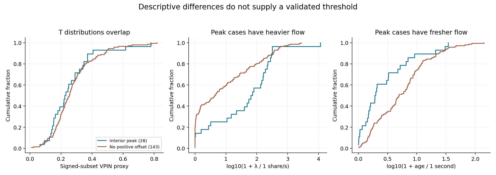
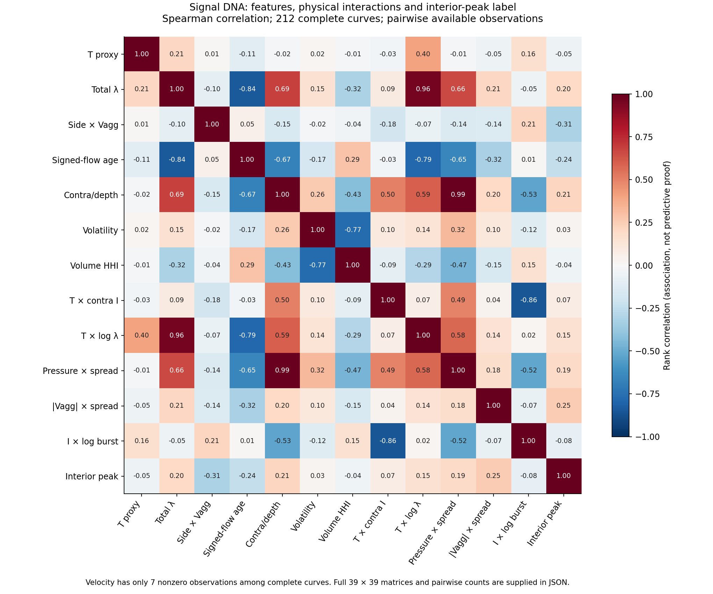
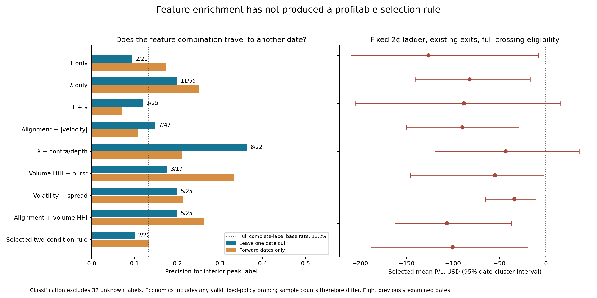

# Signal DNA audit — 244 frozen candidates

**No T or λ cutoff has been validated to isolate the 28 peak cases profitably.** The clearest group difference is heavier, fresher flow. The most promising tested flow/depth pair improves peak precision to 36.4% on held-out dates, but its selected fixed-policy branches still average −$43.28. A flexible two-condition rule falls from 53.3% in-sample precision to 10.0% out of date. These are research results, not a released execution gate.

**The labels need four groups.**

| Existing curve outcome | Candidates | Treatment |
|---|---:|---|
| Positive interior peak | 28 | Positive shape label |
| Positive boundary maximum | 41 | Positive at some tested offset; nonpeak |
| No positive offset | 143 | Zero/negative curve |
| Incomplete/invalid curve | 32 | Unknown label; excluded from classifier training |

The requested 28-versus-216 comparison is retained in `feature_group_distributions.json` and `correlation_matrices.json` as descriptive peak-versus-rest. The valid classification comparison is 28 versus 184 (212 curves, 13.2% prevalence). The direct peak-versus-zero/negative comparison is 28 versus 143. All 244 candidates receive held-out predictions; incomplete curves are never silently labeled losses.

**What distinguishes the groups**

| Pre-trade measurement | Peak median (28) | No-positive median (143) | Units |
|---|---:|---:|---|
| T: signed-volume VPIN proxy | 0.228114 | 0.254431 | 1 |
| Total volume rate | 67.9267 | 3.41301 | shares/s |
| Signed tape age | 0.960785 | 3.98859 | s |
| Side × signed imbalance | -0.29277 | 0.556804 | 1 |
| Contra rate / same-side depth | 0.00264955 | 6.74431e-06 | 1/s |
| RMS one-second price change | 0.0104944 | 0.0110868 | USD |
| 300-second cent-price volume HHI | 0.079539 | 0.0796906 | 1 |
| Recent 60s rate / prior 240s rate | 0.910242 | 0.859933 | 1 |

Raw λ and volatility remain separate inputs. The flow/depth pressure is an additional feature, not a replacement for raw activity. Every normalized source file was checksum verified (244 files; 20,664,495,578 bytes). Tape profiles use eligible prints in the strict trailing windows (t−H, t], including unsigned activity without inventing direction. Features end at decision time minus the frozen 10 ms feed delay. No execution or offset sweep was rerun.

**Correlation matrix and combination evidence**

The supplied JSON contains all 39 × 39 coefficients and pairwise sample counts for the complete-label comparison, direct zero/negative comparison, requested 28-versus-216 contrast, and within-group matrices. The six physical interaction terms were specified before the comparisons. Correlation of an interaction with the label is an association; the validation table below measures whether learned combinations predict another date.

| Feature / interaction | Spearman r with peak | Within-date rank r | Family-wise permutation p | Available n |
|---|---:|---:|---:|---:|
| T: signed-volume VPIN proxy | -0.052 | -0.056 | 1.0000 | 212 |
| Total volume rate | 0.198 | 0.180 | 0.2285 | 212 |
| Side × imbalance velocity | -0.314 | -0.327 | 0.0005 | 192 |
| Absolute imbalance velocity | 0.253 | 0.230 | 0.0420 | 192 |
| Signed tape age | -0.240 | -0.230 | 0.0425 | 212 |
| Contra rate / same-side depth | 0.213 | 0.194 | 0.1465 | 212 |
| T × max(−side × I, 0) | 0.073 | 0.078 | 1.0000 | 193 |
| T × log(1 + total rate / 1 share/s) | 0.152 | 0.138 | 0.7200 | 212 |
| Contra pressure × spread | 0.192 | 0.171 | 0.3075 | 212 |
| Absolute velocity × spread | 0.253 | 0.230 | 0.0420 | 192 |
| Volatility × sqrt(volume HHI) | 0.008 | -0.019 | 1.0000 | 212 |
| Flow alignment × log(1 + burst ratio) | -0.079 | -0.092 | 0.9910 | 193 |

Permutation inference shuffles labels within dates (1,999 draws), then uses the maximum absolute adjusted correlation across the 38-feature family. It assumes within-date exchangeability and does not control symbol effects or establish causality. The second label contrast is a separate exploratory family. Eight dates provide limited cluster inference.

**The velocity finding is real in the recorded data but sparse.** After removing changes below 10⁻¹²/s as numerical noise, 215 snapshots have zero velocity, 21 are undefined, and only eight are nonzero. Negative side-aligned velocity occurs in four complete-label cases, all peaks: GE (2020-01-30), AAPL, JNJ and JPM (2026-06-12). A fifth case, JNJ (2019-12-30), has an incomplete curve. Thus three of the four labeled examples share one date. The descriptive 4/4 Wilson interval is 51%–100%, before clustering and post-selection; this is not a validated 100% rule. The fixed coverage gate rejects JPM, leaving three labeled peaks. This pattern explains a small subset, not all 28. Independent raw-tape sums verify these velocity values.

**Held-out-date results**

| Rule family | Peaks / classified selections | Peak precision | Peak recall | Economic selections | Mean fixed-policy P/L |
|---|---:|---:|---:|---:|---:|
| T only | 2/21 | 9.5% | 7.1% | 23 | $-126.43 |
| λ only | 11/55 | 20.0% | 39.3% | 62 | $-82.20 |
| T + λ | 3/25 | 12.0% | 10.7% | 28 | $-88.50 |
| Alignment + |velocity| | 7/47 | 14.9% | 25.0% | 55 | $-89.96 |
| λ + contra/depth | 8/22 | 36.4% | 28.6% | 27 | $-43.28 |
| Volume HHI + burst | 3/17 | 17.6% | 10.7% | 19 | $-54.93 |
| Volatility + spread | 5/25 | 20.0% | 17.9% | 29 | $-33.94 |
| Alignment + volume HHI | 5/25 | 20.0% | 17.9% | 28 | $-106.54 |
| Selected two-condition rule | 2/20 | 10.0% | 7.1% | 22 | $-100.39 |

Economic selections include candidates with incomplete full curves if their fixed 2¢ policy branch is valid; classification counts exclude unknown labels. Fixed-policy P/L includes no-fills as zero and uses the existing stops, targets, holding limits and frozen fees. Each fold learns quartile thresholds from training dates only, with ≥12 training selections, ≥3 training dates and ≥3 peaks. A rule has at most two conditions and is selected by the training Wilson lower precision bound. No hyperparameter is tuned on the held-out date.

The fixed ridge logistic model achieves ROC AUC 0.497, average precision 0.141 and Brier score 0.127. Its probabilities estimate the peak label, not P(adverse markout | fill). The 0.5 gate selects one classified nonpeak and one unknown-label candidate; neither fills. Forward-date logistic AUC is 0.420. No probability calibration or live decision output is established.

Forward-date validation trains on at least three strictly earlier dates. The flow/depth pair falls to 4/19 peak precision (21.1%), with −$112.91 mean over 22 valid fixed-policy selections. Leave-one-date-out validation can train on later dates; forward validation explicitly removes that look-ahead in training chronology. All eight dates were previously examined, so neither result is an untouched prospective test.

**Exact candidate thresholds, and what they actually achieve**

| Full-sample fitted diagnostic rule (quality gate also required) | Training peaks / selections | Out-of-date fitting-procedure result |
|---|---:|---|
| T ≤ 0.1878285561 | 6/22 | 2/21 peaks; mean −$126.43 |
| Total λ > 66.39937569 shares/s | 11/42 | 11/55 peaks; mean −$82.20 |
| Total λ > 17.61783105 shares/s AND contra rate / same-side effective depth > 0.02979401533/s | 8/20 | 8/22 peaks; mean −$43.28 |
| 300s side-aligned tape imbalance > 0.1242030860 AND fraction of 300s volume within current ±one spread ≤ 0.07633714742 | 8/15 | 2/20 peaks; mean −$100.39 |

These exact numbers are fitted on all available complete labels and are exploratory. The held-out results evaluate the same fitting procedure with thresholds relearned within each training fold; they do not validate the final full-sample numbers as fixed future cutoffs. The full rules and each fold’s thresholds are included in JSON. None isolates all 28, and none meets the release criteria.

**Profitability, adverse selection, and the execution label are distinct**

At the already-fixed 2¢ base, the 28 peaks contain 21 positive branches and seven no-fills, totaling $2,075.88. Under zero residual crossing eligibility, 20 remain positive and eight do not fill, totaling $1,666.94. Only nine retain the interior-peak shape under that stress; the other 19 become positive boundary maxima. The label is strongly affected by execution-curve geometry.

The peak group’s share-weighted signed execution markouts are −$0.01852/share at 100 ms and −$0.01989/share at 1 s under full crossing eligibility. All 21 filled peak cases exit at their holding limit. Of their 13,711 entry shares, 11,579 (84.5%) are taker fills and 2,132 (15.5%) are maker fills. These are entry-only counts, verified from the existing execution ledgers. Positive eventual exits therefore do not demonstrate avoidance of immediate adverse selection or a passive-maker edge. Details are in `outcome_interpretation.json`.

For the out-of-date flow/depth gate, avoided negative value is $22,842.114 and foregone positive value is $6,862.113: filter uplift is $15,980.001, counted once. Yet its selected branches still lose $1,168.538. Refusing every trade would yield zero against the −$17,148.539 unfiltered baseline; therefore improvement over that baseline alone does not prove an edge. The gate’s selected-mean date-cluster interval is [−$119.26, $35.92]. These are paired fixed-candidate branch comparisons, not a capital-constrained full-strategy portfolio replay.

**Signal Refinement Protocol**

The complete protocol is in [Signal Refinement Protocol.md](Signal%20Refinement%20Protocol.md), with machine-readable status and reason codes in `signal_refinement_protocol.json`. The new T and λ trading thresholds remain unset. The flow/depth pair and sparse negative aligned-velocity pattern are frozen research hypotheses for targeted shadow observation. No new broad sweep or live activation is warranted by these results.

**Methods, reproducibility and limits**

The pre-comparison protocol, code hashes, source manifest, candidate feature panel, outcome groups, correlation matrices, out-of-date predictions and independent audit are supplied alongside this report. A portable numerical reduction replaced macOS matrix-vector operations that emitted floating-status warnings; classifications and rule decisions were unchanged, with probability parity checked separately. No production strategy file was edited.

Feature cleaning, imputation, scaling and threshold construction use training data only. Rule-family comparisons are exploratory; selecting the strongest family after reading this table introduces another selection step, so the flow/depth family is not promoted as an unbiased winner. Volume-at-price concentration uses fixed $0.01 bins and is price-scale dependent; a 300s window is not a full-session volume profile. Rates and volatility are retained in their physical units, not collapsed into one normalized score.

Relevant primary statistical documentation: [nested model-selection bias](https://scikit-learn.org/stable/auto_examples/model_selection/plot_nested_cross_validation_iris.html) explains why selection belongs inside training folds; [SciPy Spearman correlation](https://docs.scipy.org/doc/scipy/reference/generated/scipy.stats.spearmanr.html) recommends permutation inference for small samples. Neither source supports a trading profitability claim.
