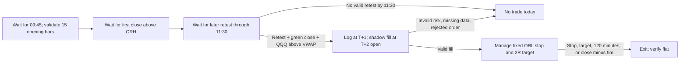

# TSLA OR15 Retest: Execution and Forward-Test Plan

**Scope:** TSLA long entries only. QQQ is a context filter and is never traded by this strategy.

**Status:** Paper/shadow testing only. The saved custom backtest is exploratory, not a verified edge: the official frozen TSLA decision is `NO_CANDIDATE`, and the one permitted official holdout run failed. This document defines a new, prospective test protocol; it does not turn the old results into valid out-of-sample evidence.

**Strategy version:** `TSLA_OR15_RETEST_2R_PAPER_V1`. Freeze this file, code, data source, and order model before recording forward results. Any rule change creates a new version and a new evaluation.

## 1. Fixed strategy rules

### Instrument, session, and bars

- Trade TSLA common shares, long only. No options, shorts, averaging down, or overnight positions.
- Use regular-session one-minute SIP bars in America/New_York time. Nasdaq's regular session is 9:30 a.m.–4:00 p.m. ET; use the official exchange calendar for holidays and early closes ([Nasdaq hours and calendar](https://www.nasdaq.com/market-activity/stock-market-holiday-schedule)).
- The source data labels a bar with its **start** time. A bar stamped 09:44 covers 09:44–09:45 and is not final until 09:45. Never use a bar's high, low, close, or volume before that bar has completed.
- Require one valid TSLA bar for each opening-range minute, plus matching QQQ data at any signal. Reject the session if required bars are missing, duplicated, stale, or out of order. Do not fill data gaps or carry a prior QQQ value forward.
- Do not use premarket bars in the opening range, ATR, or QQQ VWAP.

### Opening range and ATR

1. At 09:45, after the 09:44 bar closes, calculate the opening range from exactly the 15 bars stamped 09:30 through 09:44 ET.
2. `ORH = maximum high`; `ORL = minimum low`; `ORMid = (ORH + ORL) / 2`.
3. To reproduce the saved custom audit code, calculate the retest ATR from regular-session bars using `TR = max(high - low, abs(high - previous_close))`, then the simple mean of the latest 14 TR values. Its code uses at least 3 observations and otherwise falls back to 0.5% of close. **This implementation omits `abs(low - previous_close)`, which a conventional True Range includes.** Keep the formula fixed for this paper-test version; correcting it would create a different strategy that needs its own test.
4. At signal time `T`, use ATR calculated through the completed TSLA bar stamped `T`. Do not use later bars.

### Signal: breakout, then confirmed retest

Scan TSLA bars whose **start timestamp** is 09:45 through 11:30 ET, inclusive. The 11:30 bar completes at 11:31; no later-starting bar is eligible.

1. **Breakout:** First observe a bar whose close is strictly above `ORH`. That bar arms the setup; it is not an entry signal.
2. **Retest:** On a later bar, require `low <= ORH + 0.20 × ATR14` and `low >= ORMid`.
3. **Candle confirmation:** That same retest bar must close above its open and at or above `ORH`.
4. **QQQ filter:** At that bar's close, QQQ's completed one-minute close must be at or above QQQ's bar-based regular-session VWAP estimate. Compute it cumulatively from 09:30 through the same completed timestamp using typical price `(high + low + close) / 3` weighted by volume. This is an estimate from minute bars, not trade-level VWAP.
5. The first bar meeting all retest, candle, and QQQ conditions is the day's sole signal. If its simulated entry is rejected or the required fill data is missing, record the skip and do not take a later signal that day.
6. If no qualifying signal occurs on a bar stamped no later than 11:30 ET, do nothing that session.

### Timing and entry

For a signal bar stamped `T`:

- The signal bar completes at `T + 1 minute`.
- At `T + 1 minute`, finalize the decision and log the hypothetical order.
- The primary forward-test model enters at the raw open of the bar stamped `T + 2 minutes`. This is a shadow calculation; it sends no broker order.
- Reject the trade if that fill bar is missing, belongs to another session, occurs after the scheduled close minus 30 minutes, or produces non-positive risk (`entry <= ORL`).

The raw next-minute open is a backtest convention, not a guaranteed live fill. A market order can execute at a different price than expected ([Investor.gov on market orders](https://www.investor.gov/introduction-investing/investing-basics/glossary/market-order)). For this plan's primary statistical test, use only the frozen raw-open shadow fill and label it hypothetical. If broker paper orders are tested later, record their fills in a separate ledger and do not mix them with these results.

### Stop, target, and exits

At the hypothetical entry price:

- `R per share = entry - ORL`. If `R <= 0`, skip.
- Initial stop: `ORL`. Never widen it or move it lower.
- Profit target: `entry + 2 × R`. Do not move or scale out of the target.
- Maximum holding time: 120 minutes from the fill timestamp.
- Forced flat: scheduled session close minus 5 minutes (15:55 ET on a normal 16:00 close; earlier on a half-day).
- Exit at the first stop, target, time limit, or forced-flat event. For stop/target checks, inspect bars from the fill bar up to but excluding the terminal time-exit bar. If stop and target are both touched in an inspected one-minute bar, count the stop first. If a stop bar opens below the stop, model the exit at that bar's open, not at the stop price. Otherwise model a stop fill at the stop price.
- At the 120-minute or forced-flat timestamp, exit at that bar's open. Do not inspect that terminal bar's high or low for a stop or target before applying the time exit.
- The saved custom audit treats a target touched by a bar high (`high >= target`) as filled at the target. The project-wide config separately says a limit must be traded through. This is an unresolved execution-model conflict. The primary shadow trial retains the custom audit's touch rule; if broker-paper fills are later collected, keep them in a separate ledger and do not treat the old backtest as evidence that a touched target would have filled.
- Be flat by the forced-flat time. Never carry a position overnight.

## 2. Position size and cost accounting

- For the primary shadow trial, use exactly one hypothetical share per signal. No broker order is routed. The historic audit used 100 shares; that quantity does not establish a suitable size for any real account.
- Before any future live trial, define a maximum dollar risk budget outside this strategy. A mechanical size is `floor(risk_budget / (entry - ORL))`, capped by available buying power and any stricter account limit. If the result is zero shares, skip. Do not infer an account risk budget from the report.
- For comparison with the saved study, calculate assumed costs as `((entry + exit) × quantity) × bps / 10,000`: 3 bps per side for the normal case and 6 bps per side for stress (about 6/12 bps round trip). Keep gross P&L, normal-cost P&L, stress-cost P&L, and actual paper fills separate.
- Include broker fees and observed spread/slippage in forward results. The fixed-bps cases are assumptions, not measured TSLA execution costs.

## 3. Session state machine

At most one entry is allowed per session. A skipped or rejected first qualifying setup ends the strategy for that session.

## 4. Operator checklist

### Before the session

- Confirm the official session schedule, including early close status.
- Confirm shadow-only mode is selected, broker order routing is disabled, the symbol is TSLA, and the QQQ feed is context only.
- Confirm the data clock is synchronized to ET and bar timestamps are start-of-minute labels.
- Confirm the shadow ledger is flat from the prior session and no real TSLA order is working. This strategy permits no overnight holding.
- Confirm logging and the simulated-position reset work. If the market-data feed or shadow position state is stale or inconsistent, do not arm new entries.

### During the session

- Build and log ORH, ORL, and ORMid only after the 09:44 bar is complete.
- Mark the first close above ORH. Do not enter on it.
- For each later candidate retest through 11:30, log the TSLA bar, ATR, all retest checks, QQQ close, QQQ VWAP, and pass/fail reason.
- At the first valid signal, calculate `T`, decision time, order time, expected `T+2` fill time, ORL stop, risk per share, and 2R target.
- After the hypothetical fill, update the shadow position and attach the fixed stop and target to the simulator. If quantity or simulated order state differs from the plan, stop new signals and reconcile immediately.
- Do not override, add to, or re-enter the simulated position. Do not remove its protective stop rule to avoid recording a loss.

### At exit and after the session

- Record hypothetical entry and exit timestamps, prices, quantity, modeled costs, exit reason, and whether stop and target were both inside one bar.
- Confirm the simulated position is flat and no simulated exit remains working.
- Record every session, including no-signal sessions and data-quality skips. Do not delete losing trades or revise rules after seeing results.

## 5. Data and execution failure rules

Skip a session or signal when any required bar is missing or duplicated, QQQ has no exact signal-time bar, the feed is delayed, the session calendar is uncertain, the market is halted, the risk is non-positive, or the entry would violate the 30-minute-before-close limit. Preserve a reason code for every skip.

If the feed disconnects while a simulated position is open, do not submit another entry or invent an exit price. Mark the session incomplete and exclude it only according to the predeclared missing-data rule. A separate broker-paper trial needs a pretested protective-order and flatten procedure before it starts.

## 6. Forward-test protocol and pass/fail gates

This setup was selected after exploratory analysis, so the saved historical sample is not a clean test set. Evaluate this frozen rule prospectively on new sessions; do not tune thresholds during the test. Log a hash of this plan and the exact implementation before the first session.

Start on the first trading session of a calendar quarter and run four complete consecutive calendar quarters. If the 100-trade minimum has not been reached, extend one complete quarter at a time, stopping at the first quarter end with at least 100 completed trades. The final evaluation includes every consecutive quarter from the original start through that stopping quarter.

For the one-sided 95% confidence bounds, use 10,000 resamples of circular 5-session blocks with fixed random seed `20260925`. Include every eligible session in sequence, including zero-trade sessions as 0R, so quiet days are not discarded.

Predeclare these minimum gates:

- At least 100 completed trades and at least 2.0 trades per 5 trading sessions on average.
- Positive mean net R after both normal and stress costs; stress profit factor above 1.0.
- The one-sided 95% day-block-bootstrap lower bound for mean net R is above zero in both cost cases.
- Report the 95% Wilson lower bound and the normal/stress break-even rates. Calculate each break-even rate from that cost case's observed average winning and losing net R: `abs(mean_loss) / (mean_win + abs(mean_loss))`. Since this payoff estimate comes from the same forward sample, treat the Wilson comparison as descriptive; the day-block-bootstrap expectancy bounds are the primary significance gates.
- At least 75% of the complete quarters in the fixed evaluation window are positive (3 of 4 when the window is one year); normal-cost maximum drawdown no more than 10R; worst trade no worse than -2R; normal-cost worst-5% average at least -1.5R; largest trade contributes no more than 20% of total normal-cost profit. Also report each measure under stress costs.
- Report all trades and skipped signals, with no threshold changes or exclusions. If any gate fails, the result is **not validated**. Any revised rule starts a new forward test.

These gates follow or strengthen the project's recorded validation requirements. A successful shadow test still does not prove live fills will match the model. Day trading carries substantial risk; review current broker requirements and FINRA's risk disclosure before any live use ([FINRA day-trading risks](https://www.finra.org/investors/investing/investment-products/stocks/day-trading)).

## 7. Known accuracy limits to keep visible

- The official study configuration starts on 2024-09-25 and ends on 2026-09-24. The custom 224-trade ledger begins in June 2024 and includes 24 trades before that study start.
- The official development process selected zero candidates for TSLA, and the official one-shot holdout evaluator failed. The later custom report is not an official verified holdout result.
- The reported 45.3% Wilson lower bound is below the reported 47.0% break-even rate; the saved bootstrap lower bounds are also below zero. The report's claim of statistical superiority is therefore unsupported.
- The custom audit's ATR formula and target-touch fill rule differ from conventional/configured assumptions as described above. Freeze these rules for this new trial; a corrected version needs a fresh test.
- One-minute bars do not reveal queue position, bid/ask depth, institutional intent, or dealer gamma positioning. Those explanations are hypotheses, not measured causes.

## Sources

- Local study specification: `config/research.yaml`, `strategies/TSLA.json`, `research/tsla_deep_audit.py`, and `artifacts/FINAL_REPORT.md`.
- [Nasdaq market hours and holiday calendar](https://www.nasdaq.com/market-activity/stock-market-holiday-schedule)
- [Investor.gov: Market orders](https://www.investor.gov/introduction-investing/investing-basics/glossary/market-order)
- [FINRA: Day-trading risks](https://www.finra.org/investors/investing/investment-products/stocks/day-trading)
